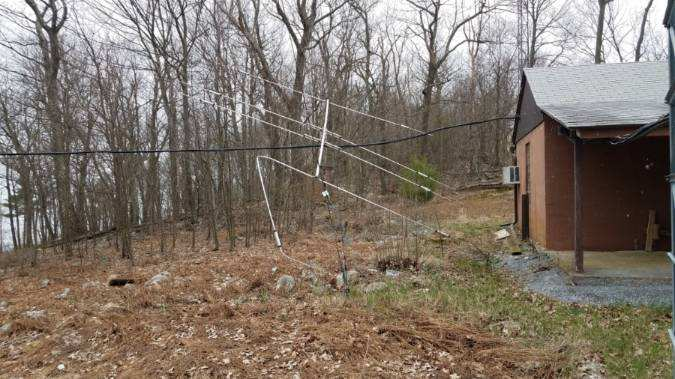

```{r setup, include=FALSE}
knitr::opts_chunk$set(echo = FALSE)
```

## Recent activities

- Mark NK8Q worked one of the March contests from the station

## Equipment status

```{r yagi-tilting, fig.align='center', out.height='500px'}
knitr::include_graphics("img/yagi-tilting.jpeg")
```

---

```{r, fig.align='center', out.width='700px'}

```

## Future work

- Repair and reinstall multi-band Yagi on North 80'
- Repair 40m dipole (West 60' Tower)
- Finish cabinet installation

## Under consideration

- Member survey about the clubhouse
- Research rotators & controller replacements
- Replace keyed lock with keyless
- Run 2nd coax lines to NARC-1 and NARC-2 to take advantage of dual receivers in both rigs
- Digital-only station
- Replace PCs and monitors

## Questions?
