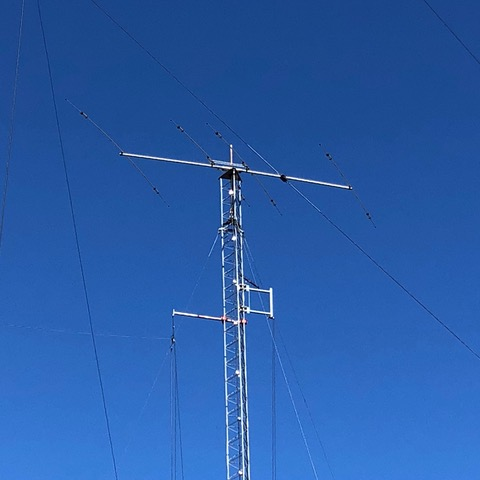
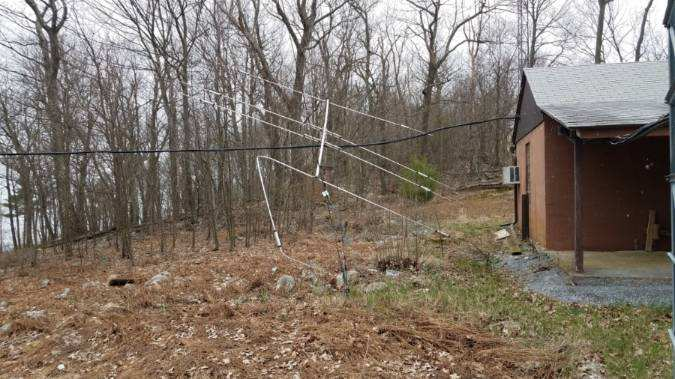
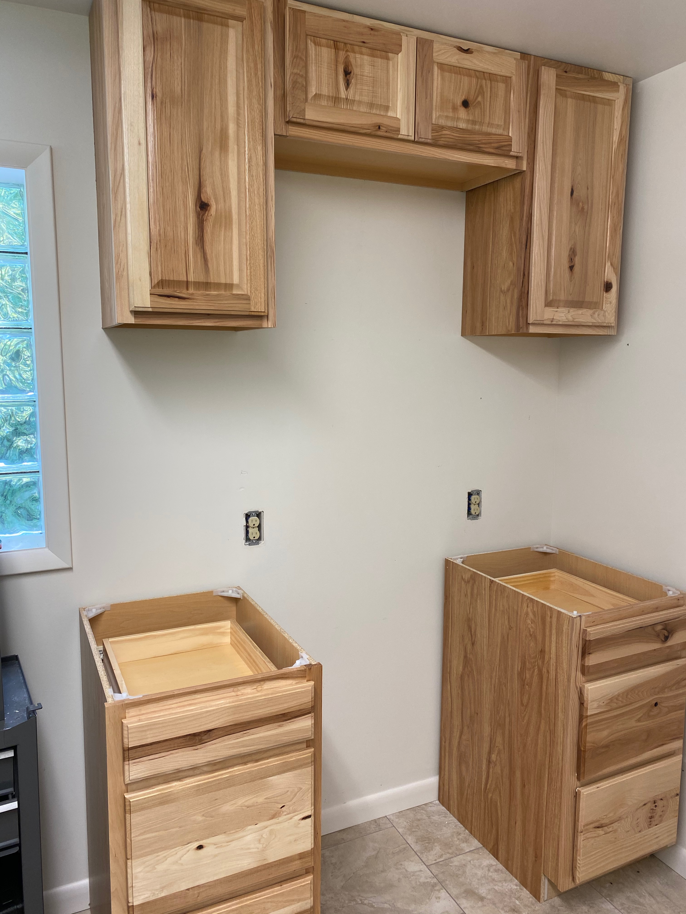

```{r setup, include=FALSE}
knitr::opts_chunk$set(echo = FALSE)
```

## Recent activities

- Work day (NK8Q, KC3FDD, N3LI, K3ROG) 
  - removed Yagi from precarious position for disassembly
  - installed cabinets on wall
- N3LI installed countertop
- N3LI installed IC-9100; updated digital software on IC-7610 & K3S

## Equipment status

```{r yagi-tilting, fig.align='center', out.height='500px'}

```

---

```{r, fig.align='center', out.width='700px'}

```

---

```{r, fig.align='center', out.width='700px'}
knitr::include_graphics("img/yagi-safe.jpg")
```

---

```{r, fig.align='center', out.width='700px'}
knitr::include_graphics("img/cabinets-waiting-bottom.jpg")
```

---

```{r, fig.align='center', out.height='550px'}

```

## Future work

- ~~Finish cabinet installation~~
- Peform antenna maintenance prior to contest season
    - Repair 40m dipole (West 60' Tower)
- Install & test private network appliance with help from Mark K0LO
- Repair and reinstall multi-band Yagi on North 80'

## Under consideration

- Research rotators & controller replacements
- Replace keyed lock with keyless
- Run 2nd coax lines to NARC-1 and NARC-2 to take advantage of dual receivers in both rigs
- Digital-only station (IC-9100?)
- Replace PCs and monitors

## Questions?
