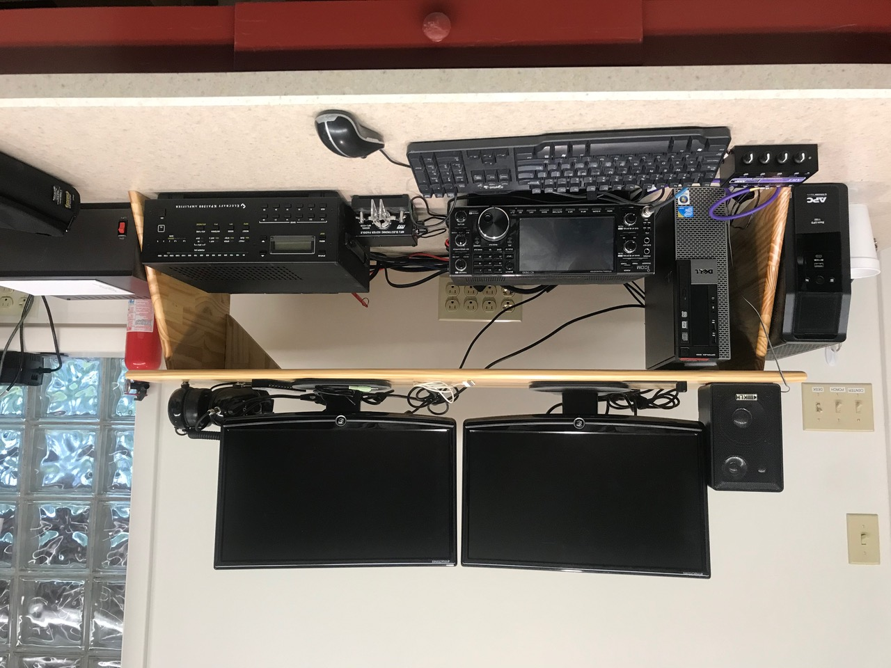
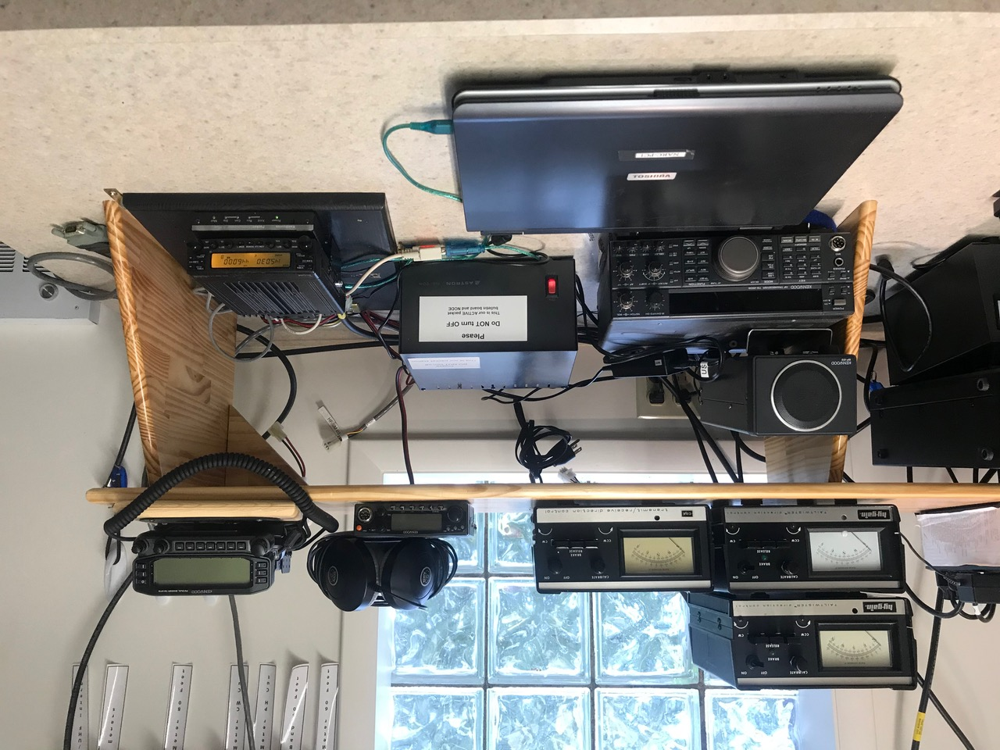

```{r setup, include=FALSE}
knitr::opts_chunk$set(echo = FALSE)
```

## Recent activities

- Work day (K3ROG, N3LI, W3EDP, W0LO)
  - Preparation for network installation
  - Install new rack for equipment
- K0LO & W3EDP
  - Ordered and installed new network cabinet
  - Awaiting new fiber optic connection replacement by N3EB

## Radio status

## NARC 1 (Icom IC-7610)

```{r, fig.align='center', out.height='500px', fig.cap='Photo: Mike Coslo'}

```

## NARC 2 (Elecraft K3S)

```{r, fig.align='center', out.height='500px', fig.cap='Photo: Mike Coslo'}
knitr::include_graphics("img/narc-2.jpeg")
```

## NARC 3 (Icom 9100)

```{r, fig.align='center', out.height='500px', fig.cap='Photo: Mike Coslo'}
knitr::include_graphics("img/narc-3.jpeg")
```

## NARC packet

```{r, fig.align='center', out.height='500px', fig.cap='Photo: Mike Coslo'}

```

---

```{r, fig.align='center', out.height='350px', fig.cap='Photo: Mike Coslo'}
knitr::include_graphics("img/clubhouse-panorama.jpeg")
```

## Future work

- In the shack
    - Decide on wifi on/off mechanism and complete wifi installation (K0LO, W3EDP)
    - Purchase additional shelves, bins (K3ROG)
    - Update user guides and manuals (K3ROG)
- Peform [antenna maintenance](antenna-status-2020-09-26.html) prior to contest season
    - Repair and reinstall multi-band Yagi on North 80'
    - Repair multi-band Yagi on East 60'

## Under consideration

- Research rotators & controller replacements
    - Goal: Computer-controlled rotation of antennas
- Replace keyed lock with keyless
- Run 2nd coax lines to NARC-1 and NARC-2 to take advantage of dual receivers in both rigs
- Replace PCs and monitors

## Recent clubhouse use

- October 3 • ARRL Simulated Emergency Test (SET), K3CWP, N3LI, K3ROG
- October 10-11 • PA QSO Party, NK8Q
- October 24-25 • CQ WWW DX SSB, NK8Q

## Future clubhouse use

- November 7-9 • ARRL Sweepstakes CW
- November 21-23 • ARRL Sweepstakes SSB
- November 28-29 • CQ WW DX CW
- December 4-6  • ARRL 160m

## Questions?
