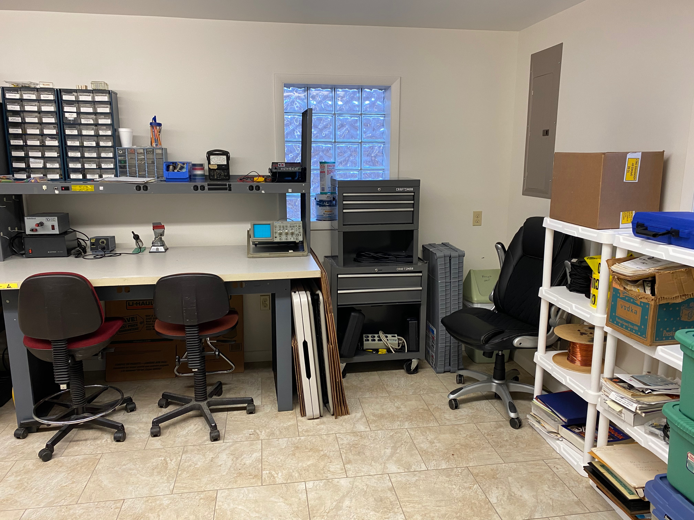
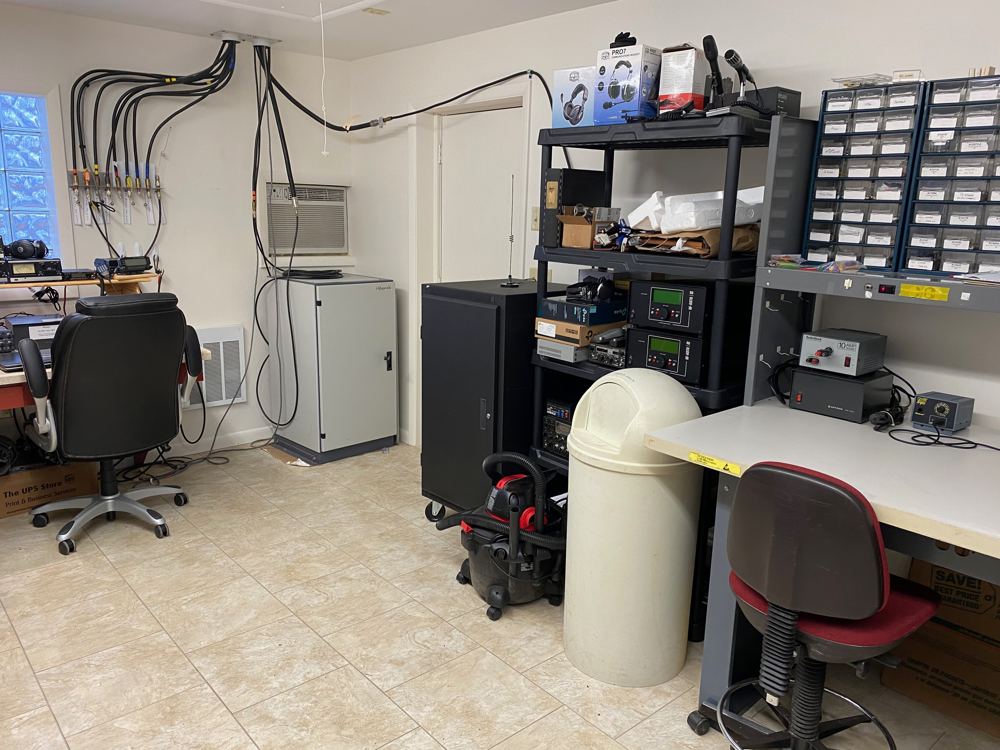

```{r setup, include=FALSE}
knitr::opts_chunk$set(echo = FALSE,
                      out.width = "700px",
                      fig.align = 'center')
```

## Recent activities

- Work day (K3ROG, W3EDP, W0LO)
  - Wifi installation
  - Additional shelving
- Work day (K3ROG, N3LI, NK8Q, KM3AJ, KR3ORY) 
  - Reinstallation of 40m dipole on 60' west tower
  - Repair of 160m dipole on 80' north tower
  - Store 2m & 70cm Yagi's from satellite station
  
---

```{r}
knitr::include_graphics("img/IMG_0187.jpeg")
```

---

```{r}
knitr::include_graphics("img/IMG_0188.jpeg")
```

---

```{r}
knitr::include_graphics("img/IMG_0181.jpeg")
```

---

```{r}

```

---

```{r}

```

---

```{r}
knitr::include_graphics("img/IMG_0184.jpeg")
```

---

```{r}
knitr::include_graphics("img/IMG_0185.jpeg")
```

---

```{r}
knitr::include_graphics("img/IMG_0186.jpeg")
```

## Possible future clubhouse use

- November 28-29 • CQ WW DX CW
- December 4-6  • ARRL 160m

## Deferred repairs

- Order replacement parts for downed Yagi
  - Reinstall on 80' north tower
- Tower & rotator maintenance
  - 60' west tower
  - 80' middle/south tower
    - Consider replacing 2m Yagi
  - 80' north tower

## Under consideration

- Research rotators & controller replacements
    - Goal: Computer-controlled rotation of antennas
- Replace keyed lock with keyless
- Run 2nd coax lines to NARC-1 and NARC-2 to take advantage of dual receivers in both rigs
- Reposition 40m dipoles to enlarge angle between them
- Retune 40m dipole for CW/digital portion

## Computer replacement proposal

- Request spending authority for a maximum of $4,000
    - Windows 10 Pro
    - Larger monitor
- Replace four computers + monitors + accessories
- NARC1 (IC-7610), NARC2 (Elecraft K3S), NARC3 (IC-9100), packet station
- Used at shack + Field Day

## Questions?
