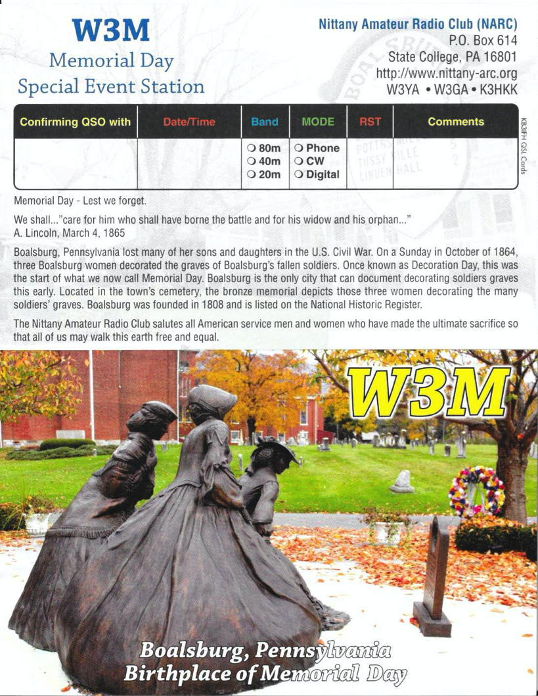

```{r setup, include=FALSE}
knitr::opts_chunk$set(echo = FALSE,
                      out.height = "550px",
                      fig.align = 'center')
```

## W3M Memorial Day commemoration

- Memorial Day W3M special event station
    - Saturday, May 29 - Monday, May 31, 2021
    - Home stations + mountaintop
- Need operators
    - Home station or mountaintop?
    
---

```{r}

```

## [ARRL Field Day](http://www.arrl.org/field-day)

- Saturday, June 26 - Sunday, June 27, 2021
- Covid rules still apply (clubs can group scores)
- Home stations + mountaintop
    - Home (Class D) and Home on Emergency Power (Class E) stations permitted to contact all stations.
    - [150W power limits](http://www.arrl.org/news/arrl-to-extend-field-day-rule-waivers-from-2020-add-class-d-and-e-power-limit)
    
