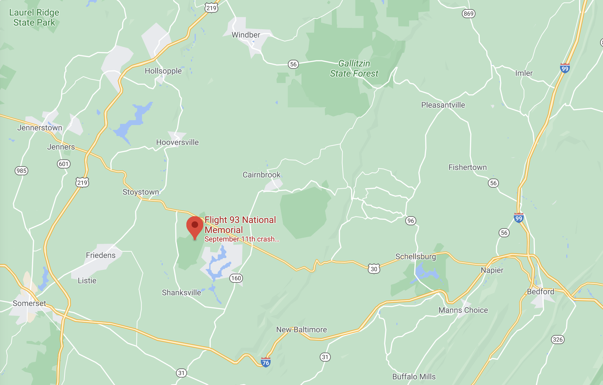

```{r setup, include=FALSE}
knitr::opts_chunk$set(echo = FALSE,
                      out.height = "550px",
                      fig.align = 'center')
```

---

```{r}
knitr::include_graphics("https://www.nps.gov/common/uploads/grid_builder/flni/crop1_1/1044574A-CD27-8808-3295FA9D1A449A42.jpg?width=640&quality=90&mode=crop")
```

## N3M Special Event Station

- Saturday, September 11, 2021 is the 20th anniversary of the 9/11 attacks
- Flight 93 crash site and memorial is in Somerset County

---

```{r}

```

---

```{r}
knitr::include_graphics("https://www.nps.gov/common/uploads/grid_builder/flni/crop1_1/CF7ADC5E-1DD8-B71B-0B50B3A2EC13EC78.jpg?width=640&quality=90&mode=crop")
```

---

- Have reserved N3M ("niner-three memorial") callsign for that date with ARRL
- Plan to operate from NARC clubhouse
    - Have contacted Flight 93 Memorial staff about securing a permit to operate from the Flight 93 Memorial grounds
- Have contacted current "owner" of QRZ.com N3M page

