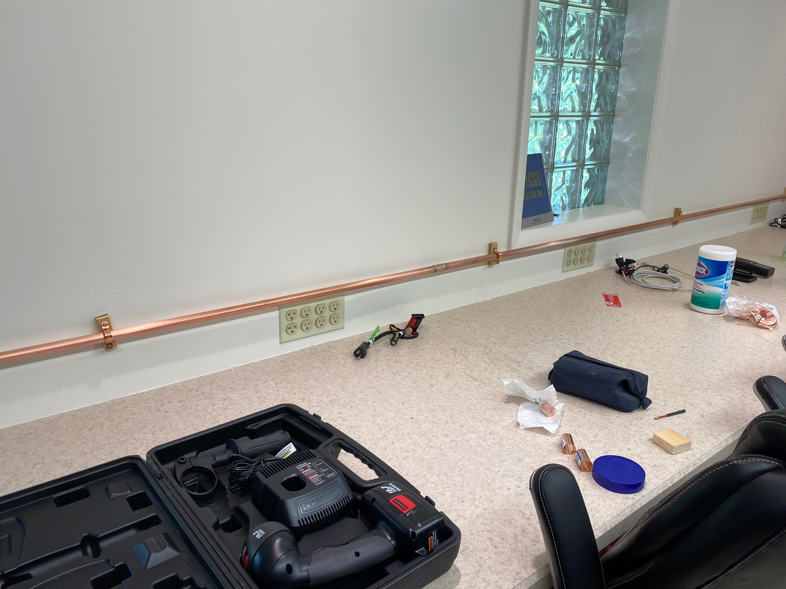

```{r setup, include=FALSE}
knitr::opts_chunk$set(echo = FALSE,
                      out.width = "700px",
                      fig.align = 'center')
```

## Recent activities

- W3M Memorial Day special event
- Field Day

## Recent maintenance

- Antenna work
  - Replaced 40m dipole with K3ROG's 20m dipole for Field Day.
  - Ordered replacement Mosley Classic Yagi for 80' (north) tower (\$1,182.95 + \$181.35 shipping)
  - Ordered Mosley Scotch Master 4 el 6m Yagi for 100' (south) tower (\$289.95 shipped)
  - Ship date estimate week of October 4.
  - Confirmed problem with 60' west tower rotor (antenna stuck pointing SSW) is not the rotor controller.
  
---

- Clubhouse work
  - Ongoing issues with ants
  - Lightning-related EMP prior to Field Day
    - Affected IC-9100, K3S (USB interface), K3YV Allstar repeater node, & 1 PC
    - Disassemble NARC3 and NARC2 stations; ship IC-9100, K3S, and one PC for service
    - Repair and redeploy K3YV repeater Allstar node and 
    - Install copper pipe for grounding bus
      - NARC1 (IC-7610), packet, APRS, K3YV + Allstar, W3YA satellite stations online
      - Next steps: Connect equipment to bus, bus to service ground

---

```{r}

```
  
## Tower repair priorities

1. Fix stuck Yagi on 60' tower
  - Test newly rebuilt rotor with existing cable
  - Replace rotor or control cable as needed
  - Need to order additional control cable
  - Expect Centre Comm in September
2. Install new Mosley Yagi on 80' north tower
  - NARC will assemble, Centre Comm will install
  - Expected date mid-October
3. Install new 6m Yagi on 100' south tower
  - Replace rotor control cable (frayed at bottom)
  
## Summer/Fall 2021 work-day projects

- Full [equipment inventory](https://docs.google.com/spreadsheets/d/1J_zTmty3JlsgPIf_KGFJ72rzpGeRJSGKMHn6ZnMDEuE/edit?usp=sharing) (shack, attic, shed)
    - Discard/sell unused items
- Wall of Fame for plaques
- Install large-scale monitor (w/ Hamclock, PSKreporter, etc. windows on Raspberry Pi)
    - NK8Q donation of TV.
    
---
    
- Dipole maintenance
    - Retune 40m dipole for CW/digital portion
    - Once 60' Yagi repaired, replace 40m dipole and reposition for better geographic coverage
    - Test, retune all dipoles
- Repaint exterior?
- Better ventilation in shed?

## Under consideration

- Replace/upgrade packet station
    - Replacing PC
    - Consider new TNC- or computer-based option (direwolf)
- Satellite antenna assembly/installation

---

- Research rotors & controller replacements
    - Goal: Computer-controlled rotation of antennas
- Replace keyed lock with keyless
- Run 2nd coax lines to NARC-1 and NARC-2 to take advantage of dual receivers in both rigs
    - Receive-only antenna?
    - Antenna switching?

## Questions?
