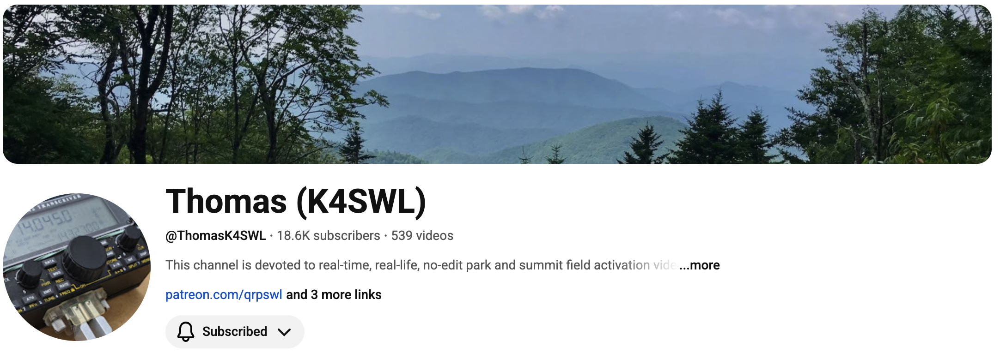
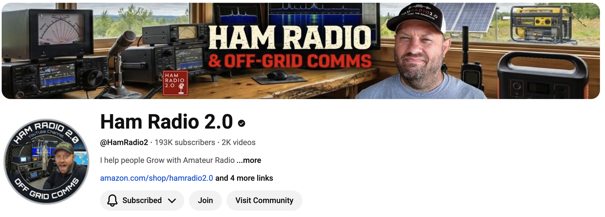
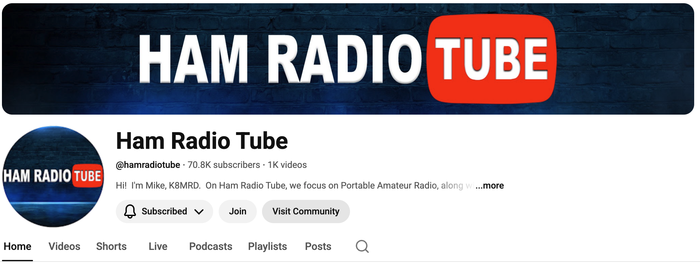
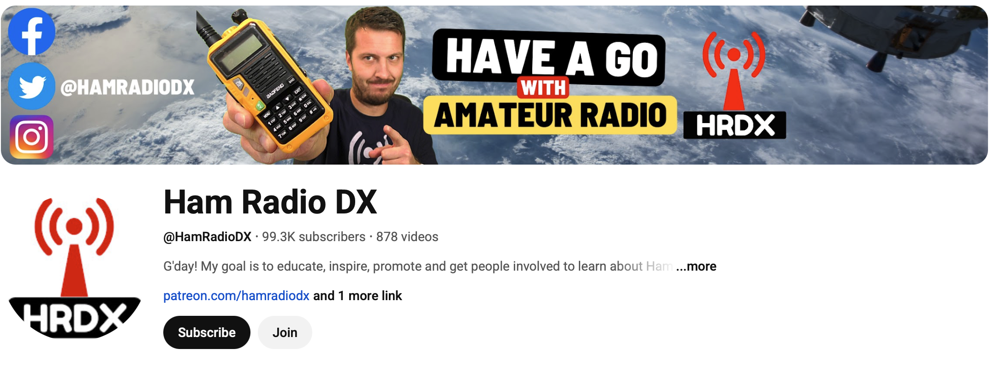
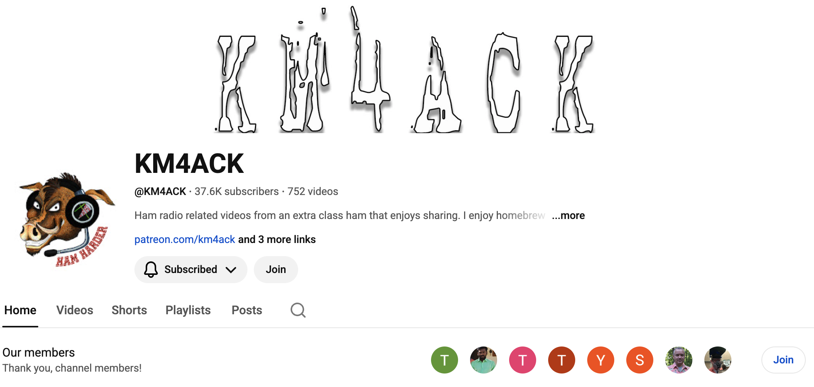

## About

- These slides document some web-based resources that club members find useful.

::: {.callout-important}
The screenshot images may be clicked on to navigate to YouTube.
:::

## {.scrollable}

[{fig-align="center"}](https://www.youtube.com/@ThomasK4SWL)

*Website*: <https://qrper.com>

*Suggested by*: Neil, W3TM

## {.scrollable}

[{fig-align="center"}](https://www.youtube.com/@MrCarlsonsLab)

*Suggested by*: Neil

## {.scrollable}

[{fig-align="center"}](https://www.youtube.com/@HamRadioCrashCourse/videos)

*Suggested by*: W3TM

## {.scrollable}

[{fig-align="center"}](https://www.youtube.com/@HamRadio2/videos)

*Suggested by*: W3SWL, W3TM

## {.scrollable}

[{fig-align="center"}](https://www.youtube.com/@hamradiotube/videos)

*Suggested by*: W3SWL, W3TM

## {.scrollable}

[{fig-align="center"}](https://www.youtube.com/@HamRadioDX/videos)

*Suggested by*: W3SWL, W3TM

## {.scrollable}

[{fig-align="center"}](https://www.youtube.com/@TechMindsOfficial)

*Suggested by*: W3TM

## {.scrollable}

[{fig-align="center"}](https://www.youtube.com/@KM4ACK)

*Website*: <https://km4ack.square.site>

*Suggested by*: W3TM

## {.scrollable}

[{fig-align="center"}](https://www.youtube.com/@KM6LYW)

*Suggested by*: W3TM

## {.scrollable}

[{fig-align="center"}](https://www.youtube.com/@QRPNet-Livestream)

*Suggested by*: W3TM

## {.scrollable}

[{fig-align="center"}](https://www.youtube.com/@The_Comms_Channel)

*Suggested by*: W3TM

## {.scrollable}

[{fig-align="center"}](https://www.youtube.com/@TheRSGB)

*Suggested by*: W3TM

## {.scrollable}

[{fig-align="center"}](https://www.youtube.com/@HamRadioWorkbench)

*Website*: <https://www.hamradioworkbench.com/>

*Suggested by*: W3TM

## {.scrollable}

[{fig-align="center"}](https://www.youtube.com/@KB9VBRAntennas/videos)

*Suggested by*: W3TM