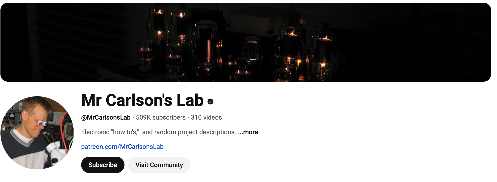
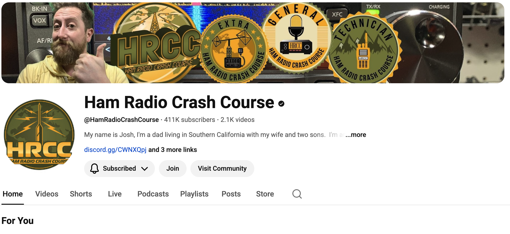
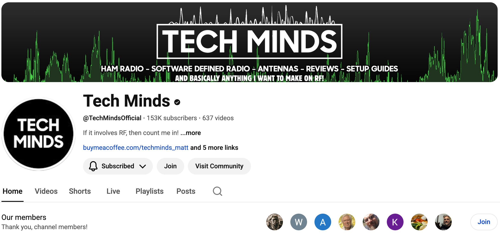
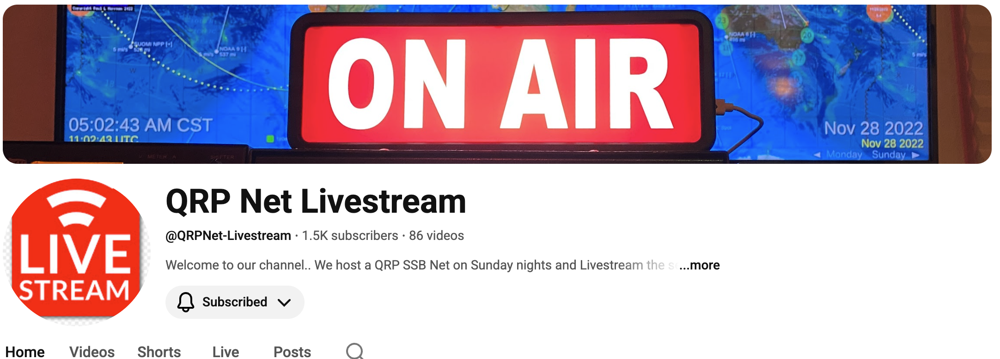
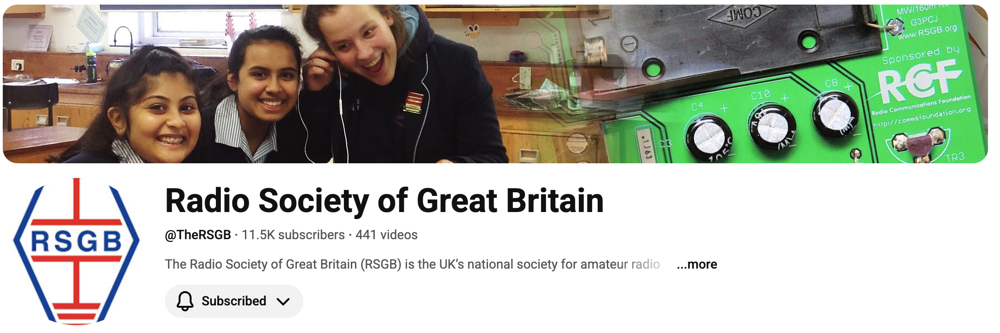
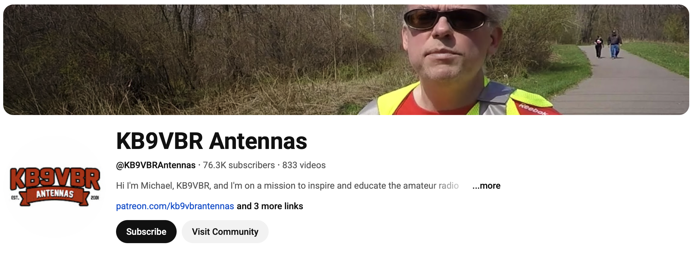

## About

- These slides document some web-based resources that club members find useful.

::: {.callout-important}
The screenshot images may be clicked on to navigate to YouTube.
:::

## {.scrollable}

[{fig-align="center"}](https://www.youtube.com/@ThomasK4SWL)

*Website*: <https://qrper.com>

*Suggested by*: Neil, W3TM

## {.scrollable}

[{fig-align="center"}](https://www.youtube.com/@MrCarlsonsLab)

*Suggested by*: Neil

## {.scrollable}

[{fig-align="center"}](https://www.youtube.com/@HamRadioCrashCourse/videos)

*Suggested by*: W3TM

## {.scrollable}

[{fig-align="center"}](https://www.youtube.com/@HamRadio2/videos)

*Suggested by*: W3SWL, W3TM

## {.scrollable}

[{fig-align="center"}](https://www.youtube.com/@hamradiotube/videos)

*Suggested by*: W3SWL, W3TM

## {.scrollable}

[{fig-align="center"}](https://www.youtube.com/@HamRadioDX/videos)

*Suggested by*: W3SWL, W3TM

## {.scrollable}

[{fig-align="center"}](https://www.youtube.com/@TechMindsOfficial)

*Suggested by*: W3TM

## {.scrollable}

[{fig-align="center"}](https://www.youtube.com/@KM4ACK)

*Website*: <https://km4ack.square.site>

*Suggested by*: W3TM

## {.scrollable}

[{fig-align="center"}](https://www.youtube.com/@KM6LYW)

*Suggested by*: W3TM

## {.scrollable}

[{fig-align="center"}](https://www.youtube.com/@QRPNet-Livestream)

*Suggested by*: W3TM

## {.scrollable}

[{fig-align="center"}](https://www.youtube.com/@The_Comms_Channel)

*Suggested by*: W3TM

## {.scrollable}

[{fig-align="center"}](https://www.youtube.com/@TheRSGB)

*Suggested by*: W3TM

## {.scrollable}

[{fig-align="center"}](https://www.youtube.com/@HamRadioWorkbench)

*Website*: <https://www.hamradioworkbench.com/>

*Suggested by*: W3TM

## {.scrollable}

[{fig-align="center"}](https://www.youtube.com/@KB9VBRAntennas/videos)

*Suggested by*: W3TM

# A deeper dive

## DIY

:::: {.columns}
::: {.column width=50%}
::: {#fig-techminds-build-your-own}
<iframe width="560" height="315" src="https://www.youtube.com/embed/s-x50tweSFw?si=8lKaLkMr-AutM2Go" title="YouTube video player" frameborder="0" allow="accelerometer; autoplay; clipboard-write; encrypted-media; gyroscope; picture-in-picture; web-share" referrerpolicy="strict-origin-when-cross-origin" allowfullscreen></iframe>

@Minds2026-hr
:::
:::
::: {.column width=50%}
::: {#fig-km6lyw-data-comms}
<iframe width="560" height="315" src="https://www.youtube.com/embed/trtgnBO8bS8?si=lIL4NijtxYs_jQZ6" title="YouTube video player" frameborder="0" allow="accelerometer; autoplay; clipboard-write; encrypted-media; gyroscope; picture-in-picture; web-share" referrerpolicy="strict-origin-when-cross-origin" allowfullscreen></iframe>

@Radio2026-yf
:::
:::
::::

## Interviews

:::: {.columns}
::: {.column width=50%}
::: {#fig-hrwb}
<iframe width="560" height="315" src="https://www.youtube.com/embed/_xZ56EXlFRI?si=lG5c-f-tbv61QD-L" title="YouTube video player" frameborder="0" allow="accelerometer; autoplay; clipboard-write; encrypted-media; gyroscope; picture-in-picture; web-share" referrerpolicy="strict-origin-when-cross-origin" allowfullscreen></iframe>

@Workbench2025-cn
:::
:::
::: {.column width=50%}
::: {#fig-q5-worldwide}
<iframe width="560" height="315" src="https://www.youtube.com/embed/DzSoY3MfXcQ?si=xw16ESPzqRu8zbrB" title="YouTube video player" frameborder="0" allow="accelerometer; autoplay; clipboard-write; encrypted-media; gyroscope; picture-in-picture; web-share" referrerpolicy="strict-origin-when-cross-origin" allowfullscreen></iframe>

@Radio2026-mi
:::
:::
::::

## QSOs

:::: {.columns}
::: {.column width=50%}
::: {#fig-sunday-qrp-ssb}
<iframe width="560" height="315" src="https://www.youtube.com/embed/ac54Gj7iS98?si=opIkDV5EhTuw6XrQ" title="YouTube video player" frameborder="0" allow="accelerometer; autoplay; clipboard-write; encrypted-media; gyroscope; picture-in-picture; web-share" referrerpolicy="strict-origin-when-cross-origin" allowfullscreen></iframe>

@Livestream2026-rq
:::
:::
::: {.column width=50%}
::: {#fig-k4swl}
<iframe width="560" height="315" src="https://www.youtube.com/embed/uhSSjHlPPkc?si=q92v9BKtt-DUYZDX" title="YouTube video player" frameborder="0" allow="accelerometer; autoplay; clipboard-write; encrypted-media; gyroscope; picture-in-picture; web-share" referrerpolicy="strict-origin-when-cross-origin" allowfullscreen></iframe>

@k4swl-2026-kq
:::
:::
::::

## Demos/Recs

:::: {.columns}
::: {.column width=50%}
<iframe width="560" height="315" src="https://www.youtube.com/embed/VfJghE4Np_w?si=Bv1h5bBYEfjy-xVv" title="YouTube video player" frameborder="0" allow="accelerometer; autoplay; clipboard-write; encrypted-media; gyroscope; picture-in-picture; web-share" referrerpolicy="strict-origin-when-cross-origin" allowfullscreen></iframe>

@KM4ACK2026-wi
:::
::: {.column width=50%}
<iframe width="560" height="315" src="https://www.youtube.com/embed/Ygu0jv6Pb5E?si=te9gYYTg7RhgVztx" title="YouTube video player" frameborder="0" allow="accelerometer; autoplay; clipboard-write; encrypted-media; gyroscope; picture-in-picture; web-share" referrerpolicy="strict-origin-when-cross-origin" allowfullscreen></iframe>

@Antennas2026-ro
:::
::::

# Resources

## References

