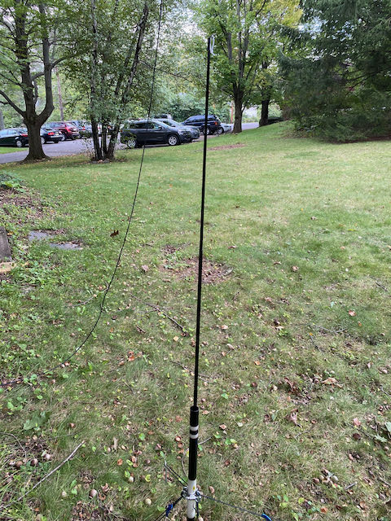

```{r setup, include=FALSE}
knitr::opts_chunk$set(echo = FALSE,
                      warning = FALSE, 
                      message = FALSE,
                      fig.align = "center")
```

## Agenda

- Remote ops
- Portable ops

# Remote ops

## Remote ops: Whys and wherefores

- Fun
- Technical challenges
- Promoting the hobby
- Emergencies?

## Background

- Gear here, you there
- Two paths
    - Your gear (+ interface device)
    - Someone else's gear

## Technical challenges

- Rig control (band/frequency/mode/filters/PTT)
- Audio in/out
- Latency
    - TCP/IP designed for "packet-ized" communication
 
## Connecting to the radio {.smaller}

```{r}
knitr::include_graphics("https://www.icomamerica.com/en/products/amateur/hf/rsba1/images/03-1.png")
```

```{r}
knitr::include_graphics("https://www.icomamerica.com/en/products/amateur/hf/rsba1/images/03-2.png")
```


```{r, fig.cap="https://www.icomamerica.com/en/products/amateur/hf/rsba1/default.aspx"}
knitr::include_graphics("https://www.icomamerica.com/en/products/amateur/hf/rsba1/images/03-2.png")
```

## Subscription services

- Remote Ham Radio (RHR): <https://www.remotehamradio.com/>
  - \$99/year (or \$20/mo) + airtime (\$/min)
- Runs in web browser
- [DEMO](https://www.remotehamradio.com)
  
## 1 hr/wk for better equipped station
  
```{r, echo=TRUE}
hrs_wk <- 1
fee_yr <- 99
dollars_hr <- 0.59*60 
wks_yr <- 52
(rhr_yr <- fee_yr + wks_yr*hrs_wk*dollars_hr)
```

## 3 hrs/wk for a lesser-equipped station

```{r, echo=TRUE}
hrs_wk <- 3
fee_yr <- 99
dollars_hr <- 0.09*60 
wks_yr <- 52
(rhr_yr <- fee_yr + wks_yr*hrs_wk*dollars_hr)
```

## WebSDR

- WebSDR <http://websdr.org/>
- Free!
- <span class="red">Receive only</span>
- DEMO <http://websdr.k3fef.com:8901>

## Your gear

- VNC-based
  - K3ROG-10 APRS iGate
  - Old Mac Mini running Ubuntu 19, APRSISCE32 under Wine (thanks N3ABF!)

---

```{r, out.width="900px"}

```
  
## Raspberry Pi-based

- RemoteTx <https://remotetx.net>
- RigPi: <http://rigpi.net/> station server
- Universal Ham Radio Remote: <https://github.com/F4HTB/Universal_HamRadio_Remote_HTML5>

## RemoteTx (<https://remotetx.net>)

- Computer
    - Raspberry Pi (3B+ or 4)
- Radio
    - Elecraft K3, KX2, KX3 (HF only)
    - Yaesu 991
    - Icom IC-7100 (w/ VHF and UHF), 7200, 7300, 7610
    
## RemoteTx (<https://remotetx.net>)

- Sofware
    - Custom RPi image
- Subscription service \$40 (6-mos) or \$70/year
- [DEMO](https://k3rog.remotetx.net)

## RigPi

- Raspberry Pi (3B+ or 4)
    - You provide or buy [RigPi Station Server (RSS) from MFJ](https://mfjenterprises.com/collections/rigpi/products/mfj-1234c-rigpi-remote-station-server)
- One-time charge for software ($30), but paid upgrades
- CAT control via browers; audio via 3rd party app (Mumble)
- Works with multiple rigs
- DEMO

## Third party software

- ICOM RS-BA1-V2: <https://www.icomamerica.com/en/products/amateur/hf/rsba1/default.aspx>
  - Windows only
  - \$159.99 from [DX Engineering](https://www.dxengineering.com/parts/ico-rs-ba1-v2)
- wfview (<https://wfview.org>)
  - ICOM IC-705, 7300, 7610, R8600, 7850, 9700 (+ some older rigs) 
  - Free & open source
  - Windows, Mac, Linux

## FlexRadio

- SmartSDR and Smartlink (for FlexRadio)
- Windows 10/11, Mac OS, iOS
- DEMO

---

- Full control of radio, waterfall
- Easy set-up (largely plug-n-play)
- Can run digital modes (e.g. FT8) within app itself
- Works over wifi or even cell networks
- Mac OS and iOS apps pricey

## K3ROG take

- SmartSDR is <span class="blue">awesome</span>--but you must have a FlexRadio
- RemoteTx is easy & fun--but only if you have one of the supported radios and don't mind the subscription model
- RigPi--supports broadest range of rigs
    - A little harder to configure, but one-time cost
    - Selling my RigPi Station Server v1 (Pi, case, + interface boards)
    
---

- Remote Ham Radio--let someone else have the headaches--get your feet wet or good for HOAs
- wfview--but only for ICOM rigs

## Questions??

# Portable ops

## With help from

- Eric W3EDP
- Brett W3SWL
- Gene AM3AJ
- Dean K3IWI

## Why portable?

- Fun
- (Sometimes) better operating conditions
- Technical/physical challenges
- Event support, emergency prep
- Jump on the [NPOTA](https://npota.arrl.org/), [SOTA](https://www.sota.org.uk/), [POTA](https://parksontheair.com/), [WMPLOTA](https://wmplota.org/), [RaDAR](http://radarops.co.za/) bandwagon

## Considerations

- Logistics & weather
- Bands, Frequencies, modes, & RF Power
- Rigs(s)
- Power
- Antennas
- Logging

## Logistics & weather

- Driving to op site or hiking/biking?
- How long a stay?
- Shelter or none?

## Bands, frequencies, modes, & RF Power

- Time of day
- CW, SSB, digital
- RF power 
    - QRP, <= 5W
    - QRP+, <= 15-20W
    - QRO, 100W
    
## Rigs

- VHF/UHF
    - HT or mobile
- HF
    - Elecraft KX2 or KX3 (QRP/QRP+), can add VHF to KX3
    - ICOM IC-705 (includes VHF/UHF; QRP/QRP+)
    - Yaesu FT-818 (QRP) or FT-891 (100W)
    
---

- HF
    - Xiegu 5105, G90
    - Lab599 Discovery TX-500
    - CW-only like QCX+ 40
    - KM3AJ's IC-7100 setup
    
---

| Rig | List Price |
|-----|------------|
| [Elecraft KX2](https://elecraft.com/products/kx2-ssb-cw-data-80-10-m-transceiver) | \$899.95 |
| [Elecraft KX3](https://elecraft.com/products/kx3-all-mode-160-6-m-transceiver) | \$1,249.95 | 
| [ICOM IC-705](https://www.dxengineering.com/parts/ico-ic-705) | \$1,299.95 |
| [Yaesu FT-818](https://www.hamradio.com/detail.cfm?pid=H0-016097) | \$649.95 |
| [Yaesu FT-891](https://www.gigaparts.com/yaesu-ft-891-hf-6m-transceiver.html) | \$639.95 |
| [Xiegu G90](https://www.hamradio.com/detail.cfm?pid=H0-016772) | \$449.95 |
| [Xiegu x5150](https://www.radioddity.com/products/xiegu-x5105) | \$599.00 |
| [Lab599 Discovery TX-500](https://www.hamradio.com/detail.cfm?pid=H0-017255) | $899.95 |
| [QCX+](https://www.qrp-labs.com/qcxp.html) | \$55.00 |
    
## Power

- Rig internal battery
- External battery
    - $LiFePO_4$ pricey, but lightweight & small
- Solar panel + charge controller
    - Roll/fold-up panels
- Generator

## Antennas & masts

- Trees or no trees
- "Stake-able" ground or no (e.g. N3M)
- Multiband vs. monoband
- Resonant vs. non-resonant

# W3SWL set-up

## Logistics & weather

- "Pickup truck" portable

---

```{r, out.width="700px"}

```

## Bands, frequencies, modes & RF power

- Daytime ops (20m/40m, 80m sometimes)
- Digital (FT8, JS8Call, PSK31, Winlink)
- SSB
- 20-50W sweet spot

## Rigs

- Xiegu G90
  - Price, waterfall, QRP+ (20W), built-in wide range (>3:1) ATU
- Icom IC-7300

---

```{r, out.width="700px"}

```

## Rig power

- 20 Ah $LiFePO_4$
- Honda Ridgeline has 110v 150-400 watt AC in-bed power outlet as backup

---

```{r, out.width="700px"}

```

---

```{r, out.width="700px"}

```

## Antennas

- 20m home-brew vertical w/radials
    - 16' fiberglass fishing pole bungeed to a tie-down in the truck bed
- Wolf River Coils "Silver Bullet Mini" 40-6m vertical 
    - radials on a tripod in the truck bed: https://www.wolfrivercoils.com/SBmini.html
    
---

```{r, out.width="450px"}

```

## Computer for digital modes

- Old: Dell Inspiron
- New: Apple M1 Macbook Air (18hr battery life)
    - Runs fldigi, WSJT-X, JS8Call, Winlink via native apps

## Operations

- POTA: Hyner View SP, Bald Eagle SP
- WFD 2019: Prince Gallitzin SP

## Hyner View SP October 2020

```{r}

```

---

```{r}

```

---

```{r}

```

---

```{r}

```

# K3IWI

## Gear

```{r}

```

## POTA activations

```{r}

```

---

```{r}

```

---

```{r}

```

---

```{r}

```

---

```{r}

```

# K3ROG

## Rig(s)

- Old: IC-7100 (now KM3AJ's)
    - Kiddie bench w/ tuner, Raspberry Pi
- New: IC-705 + "booster bench"

## Bands, frequencies, modes, & power

- 15m/17m/20m/40m/80m
- SSB, digital
- 5-10W; 50-100W

## Military mast + tripod

- 40m/80m NVIS fan dipole
- No need to guy if < 20'
- Speaker tripods if can't stake (e.g., N3M)
- 6 for \$9.95 from [Coleman's](https://colemans.com/pole-4-fiberglass-used-6-poles)
- Mast hub for \$63.00 on [Ebay](https://www.ebay.com/itm/360908000786?hash=item5407cb0e12:g:djMAAOxyyghQ7drX)
- SHOW \& TELL

## Chameleon [MPAS Lite](https://chameleonantenna.com/shop-here/ols/products/mpas-lite)

- Multiband, but need tuner
- Base-loaded vertical or EFHW
- SHOW \& TELL

---

- K3ROG owns & likes Elecraft T1 ATU

```{r, fig.cap="https://elecraft.com/products/t1-miniature-stand-alone-atu-and-accessories"}
knitr::include_graphics("https://cdn.shopify.com/s/files/1/2029/4979/products/T1_photo_b1_500_896dca1b-dc93-479b-b81c-b491512ac820_530x@2x.jpg?v=1550178407")
```

## SOTABeams Band Hopper linked dipole

- SOTABeams mast in hitch mount
- Lightweight antenna, nicely built
- Resonant, but can't band-hop without adjusting links (alligator clips)
- SHOW \& TELL

## SOTABeams linked dipole

- Fishing pole mast on ground
- [Ebay Example](https://www.ebay.com/itm/283999933253?_trkparms=ispr%3D1&hash=item421fb71345:g:jbUAAOSwUZdfER5l&amdata=enc%3AAQAGAAACkPYe5NmHp%252B2JMhMi7yxGiTJkPrKr5t53CooMSQt2orsSS2tefNAzyjxA1Q1YVqaAQLNQTsyMO1lUZ1I9M6xM%252Bsd93etFc8LW8x8fh2UcfHtnmE4Dh3c2KWeDhlxtxgZNGp1SreFRAzNX2XwXlImqa9A5no%252FI3V%252FQFXpLMULs0dwteprmhQBzvLHHCuNut1nFSYAcrg19Ab2EpZnjjRiteS9cpiIVAOlKTVg5X3tTB%252BtfK7HSf0VRDbAGhozLVTVb44K4HmsOGU0cFe%252Bje%252BwGC87gVYi%252FSuxdkhYODF8tIdIMLrrejzoGMV%252FWLQIxMwQEroi8r4XdASKu846UaQE%252Fyz9pqI7YzfOuy7%252BqVs0MZiMdm6pJXb%252Bcj0imwMfShimO%252FWtrMo9UjbbIyDsSJF7oNw41I3CxTlNM7%252BTM30fvB0WtggtctxZpB8%252BlVOcjNSuAwaEbu7UdW%252BHGiYJRUSGak4A%252BBDu6jC%252FNXTNEtI%252F7bXFYvLbm7%252FZRjp4oGxOjGSbABznQtDbV33DcoqvtjCaBjh2rvXJejvN2UT5yHbDKyCubsTOAVd58WcIKurvomP4FOvwV8BfxCPtfzKRYgYArwfNEFysDJdW%252Bei3tqYUsp%252BtvGFPgEUNVmpQUhYM6ZehVwZqPZ%252FlQP2hhdcNbswnVo39hv5gnmUGZNPEow4vpRIBESFJvJHofV4tZqb6dUvCUi4QUawO7%252FN3UmkwnKFdjogBhCZgc0vCdqu1i0xIf1nDUrQRbUVE6t92jXZEDryIrcZ7cgfQGhJUugNZGwErbev%252FB3WEPlQoqvdqesyOfV8sikYw%252B7I4ZRuVTBQt5HdIci1ywGdLsn6n5V1atUILoT5c9WDz2owMANx%252B37nMh19ei%7Campid%3APL_CLK%7Cclp%3A2499334&var=585461345225)

---

```{r, out.width="700px"}

```

---

```{r, out.width = "400px"}

```

---

```{r, out.width="400px"}

```

## K3ROG quick takes

- Pricey/good value/heavy-duty/easy to setup/moderately heavy: Chameleon MPAS Lite
- Mid-price/heavy/stable: Mil mast + tripod
- Cheap/lite: Fishing pole mast + dipole/EFHW

## What's your jam?

- It's a hobby, gosh-darnit!

## CW/Digital modes

- QRP rig (IC-705; KX2/3; Xiegu G90) or
- CW-only rig
- Laptop (digital only)

## Phone

- QRP rig + amp or
- QRO rig

## Resources

- [OH8STN](https://oh8stn.org/) blog and YouTube channel
- [Ham Radio Crash Course](https://www.youtube.com/channel/UChAu6Cof9KlfFxSbL9ytosQ) YouTube Channel
- [QRPer blog](https://qrper.com/) blog
- [K6ARK Portable Radio](https://www.youtube.com/c/K6ARKPortableRadio) YouTube channel
- [K8MRD Radio Stuff](https://www.youtube.com/c/K8MRDRADIOSTUFF) YouTube channel

## Ideas

- How about a club-sponsored multi-POTA activation marathon?
    - Bald Eagle SP
    - Black Mo SP
    - Rothrock SF
    - Whipple Dam SP
    - Greenwood Furnace SP
    - Poe Valley SP
    - Poe Paddy SP
    
---

- Winter Field Day (Jan 29-30, 2022) at Black Mo SP
- "Middle of Nowhere" Special Event (PA geographic center: N3S/W3E)
- How about our own RaDAR activity?
- Field Day 2022 in the field

---

<https://nittany-amateur-radio-club.github.io/presentations/ham-radio-out-there.html>
