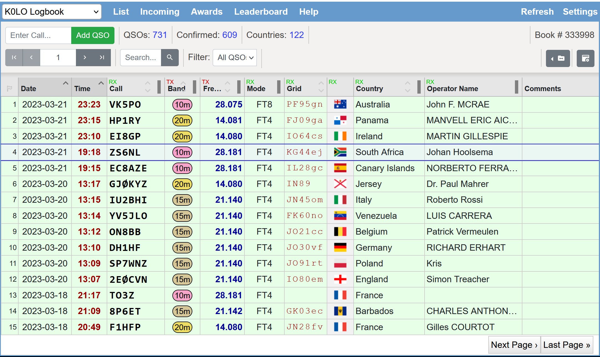
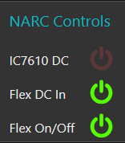
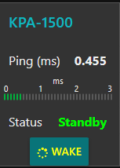

```{r setup, include=FALSE}
knitr::opts_chunk$set(echo = FALSE,
                      warning = FALSE, 
                      message = FALSE,
                      fig.align = "center",
                      out.width = "90%")
```

## Agenda

- Antenna upgrades this spring
- Experiments in remote ops

## Antenna upgrades

- In Centre Comm queue for this season
- K3YV, N3LI, W3EDP, & W3TM coordinating with K3ARL

## Planned upgrades (Centre Comm)

- New rotator for 60' west tower (Mosley Yagi)
- New Mosley HF Yagi and new rotator for 80' north tower
- Rotator swap-out and new 6m Yagi for 100' south tower
    - Remove existing 2m Yagi; replace?
- Integrate rotator controllers with PCs
    
## Planned upgrades (NARC members)

- Assemble Yagis for Centre Comm
- Replace 160m dipole
- Replace 80m or 40 m monoband dipoles with 80/40 fan dipoles

## Experiments in remote ops

- Remote-capable equipment
    - Flex 6400M (NARC2) & Icom IC-7610 (NARC1)
    - Elecraft KPA 1500 amps
    - New Green Heron rotators

## Goals/rationale/team

- Explore feasibility, technical issues
- Low-likelihood of lightning events in March (!)
- W3TM, W3EDP, N3LI, and K0LO
- Can we do it -> should we do it

## Results

- Established remote power on/off capability for Astron power supplies to NARC1 & NARC2 (~ K3YV UHF repeater)
- Established remote access (and power on/off) to Flex 6400M
    - Receive and (low power--no amp) transmit
    - Digital and phone
    - Up to two users at a time; only 1 transmit
    
---

```{r, echo=FALSE, fig.align='center', fig.cap="Digital QSOs by K0LO via NARC Flex 6400M"}

```
    
## Demo

- NARC Flex
- [W3TM IC-7300](https://w3tm.remotetx.net)
    
## Findings

- Users share the same credentials
- Users must have PC (free), Mac (\$), or iOS (\$; iPhone or iPad) app
- Lightning occurs in March!

## In progress/under exploration

- NodeRed dashboard (K0LO & W3TM)

```{r, echo=FALSE, fig.align='center', fig.cap="Sample NodeRed controls", out.width="25%"}

```

---

- KPA 1500 control

```{r, echo=FALSE, fig.align='center', fig.cap="Sample NodeRed KPA 1500 controls", out.width="25%"}

```

---

- Antenna disconnect schemes (N3LI)

---

<iframe src="https://player.vimeo.com/video/133917999?h=081520d87b" width="640" height="360" frameborder="0" allow="autoplay; fullscreen; picture-in-picture" allowfullscreen></iframe>
<p><a href="https://vimeo.com/133917999">Amateur Radio Antenna Remote Disconnect for Lightning Protection</a> from <a href="https://vimeo.com/user42146839">alk</a> on <a href="https://vimeo.com">Vimeo</a>.</p>

---

- IC-7610 control
- Options
    - [RemoteTx](https://remotetx.net) (W3TM & K3YV use).
    - Win4Icom, WFView, or other client program.

## Should we do it?

- "It" == make remote access broadly available
- Technical vs. policy/admin challenges

## Pros

- Few members use mountaintop equipment now
    - Remote access might encourage use
    - Access to radios & antennas a major benefit of membership
- Solving technical challenges related to remote operations

## Cons

- Increased risk to equipment
- Managing who gets access & when
- Who manages technical problems

## Discussion

- What are our goals for the mountaintop station?
- Does remote access serve them?
- Benefits vs. costs?
