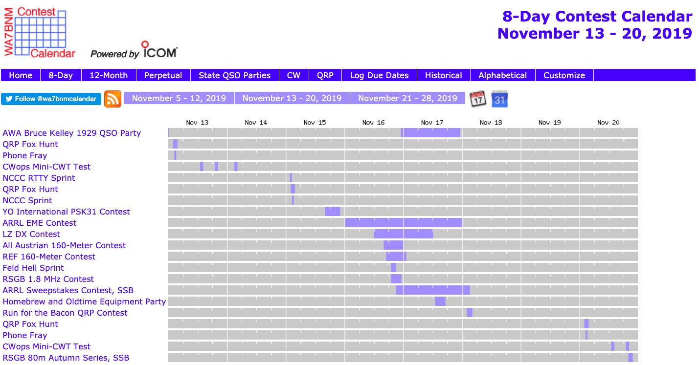
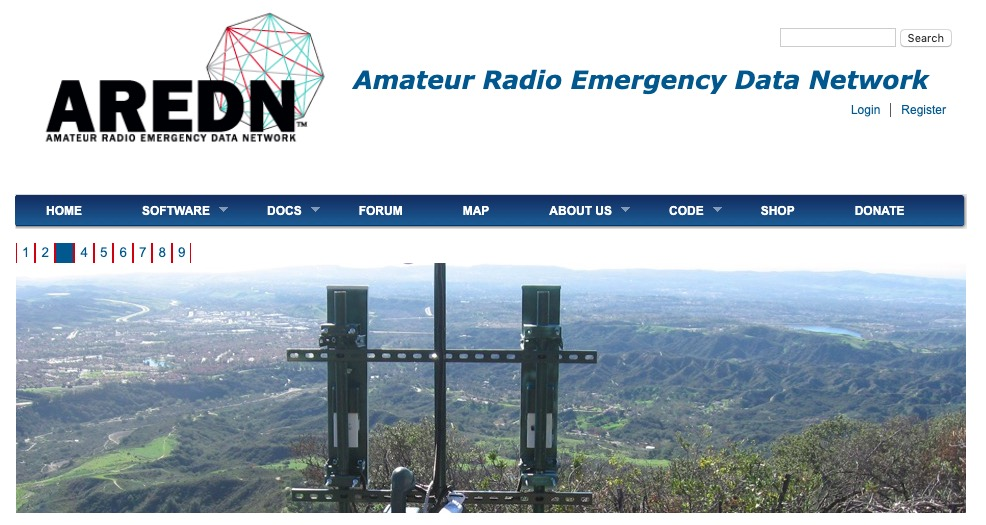
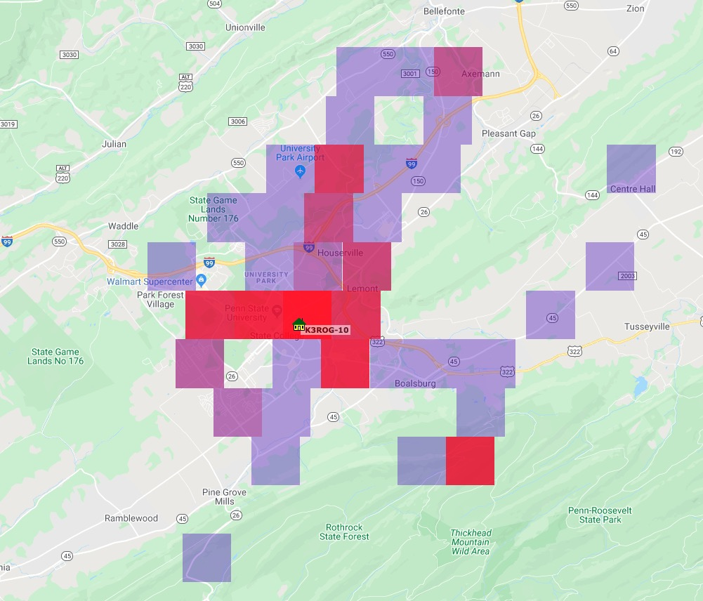
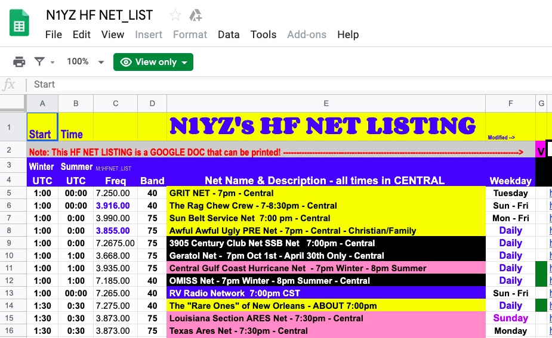
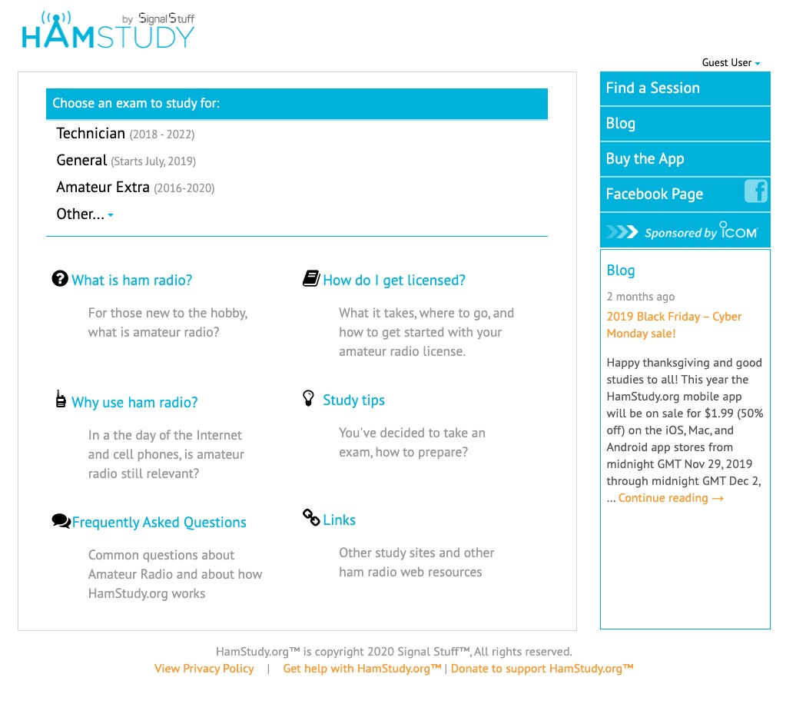
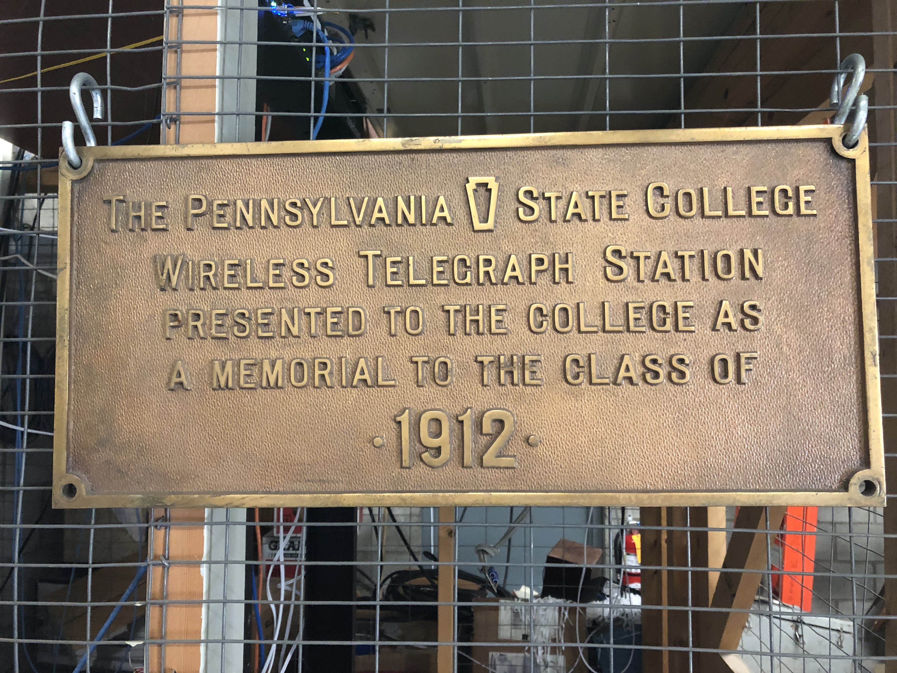

```{r setup, include=FALSE}
knitr::opts_chunk$set(echo = FALSE,
                      warning = FALSE, 
                      message = FALSE,
                      fig.align = "center")
```

# Preliminaries

---

- Professor of Psychology
- Penn State Amateur Radio Club Faculty Advisor, K3CR license trustee
- [Nittany Amateur Radio Club](https://nittanyarc.net) Mountaintop Clubhouse Co-Manager
- Ham since June 2016

## Agenda

- Radio is everywhere
- A zillion hobbies in one
- Next steps

# Radio is everywhere

---

```{r}
knitr::include_graphics("https://icdn6.digitaltrends.com/image/digitaltrends/smartphones-1175-1500x993.jpg")
```

---

- [Wifi](https://en.wikipedia.org/wiki/List_of_WLAN_channels#:~:targetText=The%20802.11%20standard%20provides%20several,into%20a%20multitude%20of%20channels) (900 MHz, 2.4 GHz, 5 GHz)
- [Bluetooth](https://en.wikipedia.org/wiki/Bluetooth), (2.45 GHz)
- [GPS](https://en.wikipedia.org/wiki/GPS_signals), 1575.42 MHz; 1227.60 MHz; 1023 MHz.
- [Cell/mobile](https://en.wikipedia.org/wiki/Cellular_frequencies), (too many to list!)

# A zillion hobbies in one

## Summits on the Air (SOTA)

```{r, out.width="800px"}
knitr::include_graphics("https://www.mountbakerexperience.com/wp-content/uploads/2017/11/KG7EJT-on-Carne-Mountain-2-1024x683.jpg")
```

<small>
<https://www.mountbakerexperience.com/summits-on-the-air-dispatches-from-a-society-of-mountaintop-radio-operators/>
</small>

## National Parks on the Air (NPOTA)

```{r}
knitr::include_graphics("https://ke2yk.files.wordpress.com/2016/07/acadia_npota.jpg")
```

## Walmart Parking Lots on the Air (WPLOTA)

```{r, out.width="800px"}
knitr::include_graphics("https://i.redd.it/wnn5bygi9lu01.png")
```

---

<iframe width="800" height="450" src="https://www.youtube.com/embed/EGw7ZIIsKWs" frameborder="0" allow="accelerometer; autoplay; encrypted-media; gyroscope; picture-in-picture" allowfullscreen></iframe>

## Contesting

```{r, out.width="750px"}
knitr::include_graphics("https://1.bp.blogspot.com/-fKyBeZYdRPk/W4BcgOCGxSI/AAAAAAAAEAE/4voRqngLYjQRAjUB3HZDNCh8qoK2C6VVgCLcBGAs/s320/p1.jpg")
```

<small>
Ria Jairam, N2RJ
</small>

---

```{r, out.width="1000px"}

```

<small>
<https://www.contestcalendar.com/weeklycont.php>
</small>

## World Radiosport

```{r, out.width="700px"}
knitr::include_graphics("img/wrtc-2018.jpg")
```

<small>
<https://en.wikipedia.org/wiki/World_Radiosport_Team_Championship>
</small>

## Weak signal modes

```{r}
knitr::include_graphics("https://dx-world.net/wp-content/uploads/2017/09/flex_ft8.jpg")
```

## Software defined radio (SDR)

```{r, out.width="1000px"}
knitr::include_graphics("https://qrznow.com/wp-content/uploads/2019/01/6400M.png")
```

---

```{r, out.height="550px"}
knitr::include_graphics("data:image/webp;base64,UklGRtAYAABXRUJQVlA4IMQYAADwdgCdASoqASwBPrFUn0okIqGiphh6AIgWCeluz2PbewZne9oMljwsx4Te4X6D/cXuZy84kfzX8D/wf8B7kOy3gC/jf873rcAX6F/evR++68+P4X1A+CEoAeTr/p+RL6y/9f+m+Ab9eOtL6RxN6LLxIOGXiHfVFNv3DBi/svF2dw3WfUBa+VBkxIpeLRHnHJ7wqkvNrn7l26Yqud097iYNxRug/MfwRmH/KJ9VSxT+4kVAhozxD8I27cq16SVFiYlM8Y+qBCQiAMRJIk2uHL8FBD6Ls3QyES6g5H7eP/chg6yUkHEDM0RKHwmHMHrnPI04xbb6EqDQh/mRP7iRUCGkxD45raayKqwJ9lIWNHu6bRbpFyHdNrdlDTxQ9CsCbdjjARccwO8FwJVjvgT+FRU/DPng7+Jwx3WpiqGZinC4SruOlyKKvsh86YkRny7XGJaVbVVTVyr9QGzgIf6Z+uHzJeppLrmZRiwbvhHiOvCvGsIPuwgb/ChK6YYoZHqUSPsmHvt/u4jlkZIyIkwOlAdOzEsojAW0TGuh7Wn05BsiMFVXDsfnOmf0VfnxWMY91cic05Qy8RLcu1xm64k53DpsYVRrPl+YXWkgJyJlovqa3lx/BCwCTneiVCJfRoYD3OXg1Uex0TDWmwp/mq6RvlBuf6W1S2T1UioHBXqGj2klE33fZO8v3A7uoLMYb1T6mb/QPxRwGEdLwkx9Gsm26eV0RzBkUru1P1DGmA5k8wvz1n5xgdO0p4r43NCznI+wrxf2gIJmyJhdTRKqi5gQGDxl6rn0CIKd3oZuCwRZLHBt8n/wou05QeOtR17rhnEv/73voDHMT8I0awiCx/iXAWvEg1ir1Dxf1k1SqTLyiQhr2tODT8XYril2qmiW9cANL+Mxr7BWZq2/hZ9DEBdlEzguH/DmFk+QKzJje35yk42jNt4KpOC6g51UU/S65S2bLh1UBP+7MUX24tOTggj+TjUdD2DcuvWhjmAmH9LVZLuo6WuIOzGTvliX94twCKYWYe+Q4uiHLKi5jxq1gWMqGpfFOxpem9NTHN5Wk9+nr8txhrIOGWztZVSU3rFBns83xlSUbTdQ/xkLc7XM5weVY1NRk1qrpQ+BUS/3psJCeOWHA05bcIDKVLF0VGvEg4ZeHiK8mDFHhE6gXVTi2qkYr2Ujp6pFLHoNE2R9My5VbJh8CostpMFxo6LSUiqlrGzNP0lcpfhoTWjCpucgP5/jv0TT/zxxag58CostnhJm9dCev+pJtqLnN6ucnih8Cosu8gAA/v4F0AAFRFMYDmsEzas5VQqVbFCtGmOp7Mv2kSidEW6puHf8Ocgr14RaRXXceZtvzJMc+z65wIaLvSZd/RaYT/6V50Dj3s2e0AA+inKxeBYcNzQ22Rpo5Gdaj+Ity9faAAv7FGyzPqLMItGPcAeq5M4f89XoTynXn3rHCUU6mhkBeTF4MqgGr4j0hdNP9q4YemUr/u4cqomCW85pue8YhPVZsYEu8DsWuIvXnA2hvZkPNBG0wtRQA8LwU2PYPiRv/21FkaWD0fdEI5OZzPhlyiijMJ9KUmPeS1PGX2xM72GknhZCMBJY2ykyuA+Ma3czXR9QAA3KOil4zUOecrOjvaxRqyNV2T+u/sZkjc66TVfaG27Y9fidg4NtY69O9bJ7zXs+GViZlmNT6yJs0TuELYaHOHlE3hQvNFoLSzTo4aHaTWpfjPbOww2pCa9R8qOiZgkJTAWx79gcacDGeeXN/1xH7kKxZOcZcgZOvf62G4qeG2BJnZ23iqgzqcSe/b6OmQqN2Fz23Nmj5dVniZDBfep6IxQPWgLre/U8IxtZGMTzDwrW5jh2JCSyA+jZTDmSGc7wF+ZOGBEKycnCaa4ZS0AMZe3FVI5nrgPzKzmkucn7c9GVVh6CtvatRGLomGuqx5qRNbf3/wNyQHNrRE92kKJpz2vX71EfZekLAw4tZeTRYIaEr0sbeMiATIzkp2vWQrR22ZA8glgvb9hC/9MPH7B6cJfw2/pbEYuawCk9e9Wt/uGvQTgeWLLj4JTSzdm6323hW7i2DiqGdMDRKqxID0bXLtf4ISC5+TPcyIV/qzitsikk8Aa20YP4EAuKAA968Q2LBRB8orsAR7EAUYzdWXxOvTgaoFZTd/ywVQ7RSyEAY2o3WNrv4jz6mzBEdcpJcpnptssrdLBLg5T8pGVQCH7ptWvt9sFLy0XSEd5UvHf99j62AwyZSSxKRZTJEeEqIEdYRqWUpqM7wN/cUvEIpZdyZSlHhJbfCi8GLOwHOOLNPySw31fwUcBYyCkAAFBKd8TT7EeUvOOYpQ27rEZYs/QE8G3jFLUd4IB0yBIeWwUWWJnPmYhbQsb+7RqMkrbCVKVjBvQdOhiFaIknnaCF/dc/KMDbGliMOJD/0iCDLYL8p2ESsi0pTOuRvJySaD098frPYNKlWyNr0YfjQruK3jDck8lipeCAv9MiZZAWpg/SayaVtgQ3n2uGb60aICKHtP59oBdUATPrr6Ygzg+MDfFbPuCG1lxMQaWulUE3t43+5BBs3bm1Xa1L6FRu0tE0v3VwJMwH2GUJBrv6FWrT/JS1f5sQrOVChu36F/BCw5AJefCcCEj4JOKxADk7RnZyFn8EgasISSYs7hYHhtJPAp5mr6LLcKuSsPvjgQZPuFKZ65JgYn28ODJ3Mk02jHPLRLVwAJJfeR4xQd1OS8GTAshHmGf/rymBNUejpSi7QWcPrdQvEquA3F+GMsLYZNOaUBJPS3bQyrwwG2ejGQ8066f1BU0jlnygqsxqL6Gi7GP7bRh3XXFtw4VOzdQxw2ODBFlBM4l+GP1E1O+50rFx7TYWZJCBMzEsn80zwh1ibl1x4v/HsveNnOdErcONvIDwmzNhD4HyuA7SOiBoyT4WkoQW0O63+qnUirQJ6TeRwC1uInEZKl2dfU/D1QXVT6NbVC36C2Xj10XUzIgXmw/TJIiRTUzaxiSIyTDql3gFJ75V1zRE7T3QtUE3lYQPCHuBw946Tp5wNet2T+wpto/lrM4JyLLKk26WO2JkwV7IXMsIWzR0zQooEzHhQJObliDry/2aAJrfwuUyhwKzFymIyOZhZdP0WkyYvxbv8TSpazIDPBg9Z+0MS1j+bK+3rFWPsd3U1FLwawP+NwcZ9SfzybZJIXhHz7mQoAj6W4pJcUAUfq2jTvZE4L7SQiQyxd0lWKlg58WFpWcY13cB+DOTa+luKcYeaNoR9QHuIXXuZGgNfTlK0rz8MuCWHFgQV9tq6SnxJ8dg312BTXzl/oqy+Za+fxwHicAdGxlDtd4Zy/MiprAvaFnyFkBvJLZw5Oh3aG2sv+qNCGDaqnF1mBxL4xfUSRdKiLwOex0tveeTAuseEYLvvGlYGNMDDLUHcSx0DDYUMQv6okdvl1GIStZEjojMpQ0MGWfvP415tYrvq3n7jkBQAk+1clhMue6AfHwgqHr5pog9s/ZiPZelPo9YCAhcOdrqJa1wP8BhxhGwV3dXptIOZBIMmsLaijhSYD5hHLb3gohwrBqNqBwK35/L7y2Yhgu3V6k0ETH0rubuVjVQdBDI0MsWN7039b3KGq3J4Uts9QbTSZ6y/M0/iBpjTQWisMHjh6CRAOv3PJZTeZAwdc0bX1/WfWIGVoJwfDIoMgLVyii4/OT7S8B9ugrcUnahLbnx3hj9VS51BWNTzFNu6CP40y1I0zUmG9lQdC6BbxVSytFLHhJ7Z4YJIfCKOMlzisOAFG+5plN7H2x4xhu0X+kcad1AulFF2bsWLONnGKQQDr+Sj9N4J4JcJA/aZzoY+6Zh1xZR90H6uHDlYa6vgZcTZ3aU5h20cOXX0fVQRgQ6UCbzoI6DWuXeY+Ed5Kfrm9YMUZqfzAHtDR7QbKFL+AzhA4CGkREq6afZZ5SJD8HJ5ilIHZiUM9t1vkDL8O2zQe5GIuu1/FosgFiQvrgi5Q9Pky+KAoRuVUYu2ec2tcmXpw+vHIU93e61HvrFvrrB9+RR07RMGiCKZOBiCtkL6PBuft+xTzjNgcT2igWkhdGHQlHMvHDEnK3fYqNMLiIzhcqn5VMeDP2R4rY0HmSL23aA6Clms/lHUgenw8t4dmi/I2UBk2mjw208Uf3xI59xAEiHoHs4Gyx+KV5PF1/3RpCtYU4aTMlFnH12/5I7ZrMLUCX7UXTNABWz3TM//8K5CS40sP//sK0kdlXXh44tYZEF/Ewng1a+LNmCYRIIis1ma6Ud+MuRktzwo/FQXMH/ymP9BQoVOCGJ/J5qt1lRgS4uOeLyPqwCoWVPB464AXuCcV0Y5IUZ0YqOujZyMzkNf3iX3IjL7xM2dsQo5A55fc/hq85CopBLjzgWPYkMcI7MMXtYxmFv9ibI6YEBwJuDp5f4gHETUQQW0nMJdsjDeASbihBiXrpw+cgvj6St3oGkJ4AXz8J3gXQRpI0GlBKAgjMvAsb6StAAsq/JkWt5sfe9lJmPRONBlk84AjNzUK2GWfBImT9OvYq+X4+RER6iJy+XrQqtdZZ81wm8cDpzuT2igHBqBXNaVmvo8dLiaqrFeuQ1G7z19LvdZ0rT0wcl6BfAZE84d8ADIAkmsARNHVPKm7mejurm7OXHoTF3HbA+byTM6x/CDJZAbOc5YHTYMmEXPg3QxHjwiJDT3amsWrXqpn3pD1PpeZpFDD2NMTMa1PBMPAaMjf77jhHeH1WN62pck62mGaBvhBw4N4sGe1b37omUGlE2lPSWZ2TbIHoTfr2CgupBWBqf8mc6Sm78J0I96zn3FnkDpo18dSb1o0IuRwpxF79gLkrLn3NS90gkP0toQDR2ZOSoqSDMsZJsKoJ4udiRebjMSL1z5OG7m9kSt62MfNagTwa7Dn7z5wiZeY/+aYcENaYSysE24Gv5Zhb0Fs92Tu6Xlixiz6fOeJejfrC0RsI+paEIgFrjFu3ydBbwR6OLyPnDcZU3AjPhy2FY7Vjo0HGq6vhDtLxSN1OuOufor8BNtjwVeu6rv0EFqSWJbqYC06xAso4gwkCb6OvQ3JnOaboeJMAp3HVEZhQIdLO70yECCFfbmDxBIO7zjFmdcpxLtjFac6Cl7s3PxGXT1oPzk6Xv2JWQEQQ0G1JEJqT93/C8BnH0+56fRfhi2J53kuCYdMHG6dzNYBfPR0NF3MEwfZQMipwYZQqv6BT8+ikLDKgNkKgR7AAKph+iA1wwT62zI3Leh5D87Ll59q4oqzHjnfHg7VkhRbrr4drVqzJnAgvsDWQ5HBodAIoheZ6TVI5Bx6PGJCYEWueA2902J5ErWKDs4dXCxiUzKm3RHcueH6pZvfZGPnaYddS0PiV0p3lA5wRT71mKoYXHy/dFxxvJhXkLjUX/4hU1LxMFLnIqXDhE7fNk63cOHJTar860RsqoNmwYVWd9IkOZPKWt4PePxLnt+0DsTiiud9KsKP89rUUdiVG4K6kjz9rErnykML8azHM+HR1lnm7lhLQBgxIQ2aWyusuWkzeLktvGyV+So0xdlTNJkAFmq2YRAu/4tIyB2Lc2baxJFoji8D4QHn/mQ3n2f2R8fg4w5tAjX7oPYFXH7zkvimdInYO/MDe96exD1PpC38u1XiCiWzQSQKn+Ae+yVAaGSrPT8g3UZMEn2OyMdAg9v3HE1dA6uM/2HdwveJEFNioxAWPBNMaM1R9zbkP/HVFkMI1yt7vC//FqcXR2clzE/FR5w9pw0Ffzizq2dfO9B59rYx3j4VmjgJGX9PvSuSg6Jg+bU0cInxk/mKpWrhrSZN0Af1C89kJg2mtpw3bcygtxMCBgAaMWh1VXwo15ySeW+R/DdkxVwJD0z8qf8ZtnPxavyMxKUbOhh75w5Jmf3UwT1IdmSeWynceVUo6XEErUz0H+cAa791tWNfVyMwy6Hv5x8S0cu1igThRK2+REES36aEHwIgKWvzdFGOOcVEpvIxNM8W4fSNjogcZwkCAMH6DaFZFewDK/3Y4sazwGEGGYiicJsByPcRsAcNnSXkvXvjaD+qGfUzdgpVSs9sJxDbCezOVovkfldruTJI5WzsabMmastncOfLNUL/zWaYlN0xHyUu/0E4CJz/YKdOk1rF5g2bMWHoFz3Wb+VvLXTxGfO87UKRy7ErSE9J2bUGR3met7QPAOHTOCig8A/WcYNRWkkfrVHSAr1s29pOWUE06iCJcm8JWbeL+0Ra2ce4ZnZScv/5ao51plWIBFMGRs1cHkWl8Hl9c/u/vb/B16u2FFfkC9t1PyHgck2gfkayNMr/1kFvg6nxsBjBRCKBwnoP0kaHAXl+HJbHeDkM63BO3RhJpz6TVXrwXyiPqLhL8X2D2dzPVKM8YWUXjpsGfhkZ26fLya2iX+hpc6uC+4qI7WdKYKQaM5Igrs9NPU5/F49836snuV1nn+XdV0G3U6iWHcKSt1jBSWT6cKL1IjF3An3Xc/k77lxBMXabe8tK4iUF3ZbOZKYkO5btXneMPiwMt1tvnoq6buJhgnp0J0Pp+2g8GwWu5xAFWV/v6aHXU1ZL82mTU3y+6jcCXwSQjUvWFoBDLz+igUmey2B/KzIa8RVfiim1wo/6A0Robr9sss6S7yMyeK5oCE5hO6qf2YRV1NVOmUWF5ejJTqDxAq/pU801k206/kAVJhTn//XdwmT0bn6VwF+/7LNN9DbtSY9r9rh8kSELeP6ZvSoNoJYAavJgvxV6mLc6i6AMNI9MxUH/utCw8tneHdo1L9trHdA73AkdVL7CdQS2quEaByWWBJfeAwprvp4QDmmt446xUltJVHnNuLXlp+50OnDieX/jJbs6tNOSFRbPuPC98/LRnnleFi2YpYtChNm5XeVya0HwJwv0WxkB7jcBGX7XZ26txk5qqRy6K9u9otlmtl7dQeBKFYfATiKg1lfLKXg30G8pCFy9l+yfe0yU43xwA8RzMz35A5cyHSRN1TiuX92YSy0Mr1Y3eHe2F55v06HtBTMZQYNsIYG5zC4CxEk9V/L+yQvhjLEejcd8nGP9KHnlB4fMlm19v3q8/VN2M5KPJ8ZPUHOJdebAp5s3hdX1x3/qW+zXlJOV3B138hW+FMwCD/ShWL3t68mNNGMMinMmZ4WBfNjNg1GlDM4vRo8wmRWLfV9oIsLzN9nGzEHx2Pi2VK/bYB3BWYA4n+3TelKpPjzhvWnEvubLORuH5wVl5fyyk2XqyaGtk1NYaNlIxf4gY0X3b6IncfZ/bNK4J/SFZH9WC74Jw9HO29Vfdhuv+vxx6LEs6mUP/tb3M68YJedlrbnH11iRcUpLc8KyslHbKa+qSCW1iex62u/p1vsUWe5WpdE/qlwO79yVifeDlw8D8Uw6v/R+3MPDyuUkeuMVBnXFVDZxS6Flv7HkgTz8UozCo8ZphnfXsb1/a+LUGMLa8CI/N0efFmWQjdF+VNQlFqaWNTOVusiqiSWYE1o+X2xAeJqu6a4hJRfsAcZ1H3wqCLfalfKNIa600kUpfqV0wkvMQuykR12MrglqMN1S2+5UqjwwOGoZeld2H0v+MydGUzzyn+s54rdnHj19PoU5tEklgrIOl5ItGWaC5FgYKEZFIuh583tX2H/Zz8nSj/Dak3kXkIB6fRsef1qDpW8gYepN6UUnHHqiB35+JI3O/7WtCjKnIhDEGilvODBK+xswdHJiwrArjp05U8F8Vu4S4D2XRLA3zCRYKxznPAJg5C7x7hTs95Nh2WGJ7N95cpKAQ4SM4fwFwL8PY7icG9QNpsAmEn0TKttlKcsS7r/uGNlTYszahQ+7E9lPz4dgCHc8D8AvNnw8o4ogAHJ6RE7K8kZ401TMJpR/piAdHxQNgOOjgGzbXssQ7/D1Go7Rqyxwr2K5wLMdZ+yUDiRy343/pnQHdTHANXSLPiuifrgGyMGI6ZH1oNPwcYnJ99izfIJZI2sj2AATQRKupqNIWheWwRPa+upzWMvh+vT0DF9trTmsoBd1jkqorJi+dgjalkSAi5e7qsWv9BnI8RM95dHn0o4eDz2K9by5GZ1Gdp8fWSghNgTuNLq5+hmqr4IPz9bqgH3E7migA8egbvgkAJugjzUgjGFW2aW5cJQ7ptbV8hTYnGVSKSi7kf+qZKUY7sOouCZ93MQ9OxIkPRqHx6+2sDk2i9OYgpIyO59AaSUXcwVFRRiSA0Foe8HS2clMQjZJBMwhY0dmZLJGYeF2icGuy4F+uj8w7cpW3ZYqTdhOTlSREkKrYhRtnRQYd5CSj0hvh5JynBC3Gjin2H9VIKgq1umZJREUyAMxULLetPZx8lz3DH9wh/Rej7PHxmsnkc9BbKAsaJhHHX0HX1uur/prRc+ygmCaUQXPY8ivgqY5j/fS/gfaW8vtT1iqSK0O/iGO/woAAB4z9FjGaK0UbqmwX+ZudrgIln4bBygcQyygPH7hZslOO4AA0ZQxv/arvWvuXVmiEahMWiiZBCoQt/iPdSvG1p0RB2BKtTZTg8xA3DS9wAAAAA")
```

## Atmospheric Science

```{r, out.width=="700px"}
knitr::include_graphics("img/band-conditions.PNG")
```

## Emergency/Event Communications

```{r}
knitr::include_graphics("https://news.psu.edu/sites/default/files/styles/threshold-992/public/hero-ham.jpg?itok=RCPoJ3ur")
```

---

```{r}
knitr::include_graphics("https://qrznow.com/wp-content/uploads/2018/09/b0f649f8-0a14-416a-af18-a36ba5de594c.jpg")
```

## Build & launch a cubesat

```{r}
knitr::include_graphics("https://mk0spaceflightnoa02a.kinstacdn.com/wp-content/uploads/2015/10/acd13-0175-016_1.jpg")
```

<small>
<http://www.cubesat.org/>
</small>

## Talk to space

<https://www.n2yo.com/?s=28375>

## Collegiate Amateur Radio Initiative

```{r, out.height="500px"}
knitr::include_graphics("https://qrznow.com/wp-content/uploads/2019/01/2016_Funkcamp_YOTA_10.jpg")
```

## Go where no one has...

```{r}
knitr::include_graphics("https://dxnews.com/upload/images/x3y0-bouvet-23_03.jpg.pagespeed.ic.eAml1_REj6.jpg")
```

---

```{r, out.width="800px"}
knitr::include_graphics("https://dx-world.net/wp-content/uploads/2018/07/KH1.-QSL-JB8-final.jpg")
```

---

```{r, out.width="800px"}
knitr::include_graphics("https://gdxf.de/megadxpeditions/qsls/3b7a.jpg")
```

## Hack hardware

```{r}
knitr::include_graphics("http://www.highonsolder.com/wp-content/uploads/2017/09/IMG_1024.jpg")
```

---

```{r}
knitr::include_graphics("https://heilsound.com/wp-content/uploads/2017/04/IMG_0835.jpg")
```

---

```{r}
knitr::include_graphics("https://preview.redd.it/yknot69u9xx31.jpg?width=640&crop=smart&auto=webp&s=1b40bb303f082dd88f257c51803bde70e5c10520")
```

## Build RF-based data networks

```{r}

```

<small>
<https://www.arednmesh.org/>
</small>

## Operate anywhere!

<iframe src="http://www.remotehamradio.com/" height=550px width=800px>
</iframe>

<small>
<http://www.remotehamradio.com/>
</small>

## Automatic Packet Reporting System (APRS)

<https://aprs.fi/#!addr=state%20college>

---

```{r, fig.cap="Packets heard by K3ROG-10 in Jan 2020"}

```

## Learn new languages

<iframe width="560" height="315" src="https://www.youtube.com/embed/43zA_wokXtY" frameborder="0" allow="accelerometer; autoplay; encrypted-media; gyroscope; picture-in-picture" allowfullscreen></iframe>

## Join a world-wide community

```{r, out.width="700px"}

```

<small>
<https://www.reddit.com/r/amateurradio/>
</small>

---

```{r, out.width="700px"}

```

<small>
<https://docs.google.com/spreadsheets/d/1cpaIUPJOG9Kdb0Xo-hyzhcVKcyvOr37vrGIF1mIETHs/edit#gid=906307814>
</small>

# Next steps

## Get licensed

- [Technician](https://hamstudy.org/tech2018)
- [General](https://hamstudy.org/general2019)
- [Amateur Extra](https://hamstudy.org/extra2016)

---

```{r, fig.cap="https://hamstudy.org"}

```

## Join a club

- Nittany Amateur Radio Club, <k3rog@arrl.net>, <https://www.nittany-arc.net/>

## We are...

## K3CR

Penn State Amateur Radio Club</br>
<k3cr@psu.edu>

## A Penn State tradition

```{r, out.height="500px"}

```

## Get on the air!

```{r}
knitr::include_graphics("https://qrznow.com/wp-content/uploads/2019/01/2016_Funkcamp_YOTA_10.jpg")
```

## Why ham radio?

---

It's fun!

---

<!-- The geek shall inherit the earth -->
```{r, out.height="600px"}
knitr::include_graphics("http://2.bp.blogspot.com/-diuIIhRGNkc/VilyO4VqL0I/AAAAAAAAAGk/SRDaEBkxeS8/s400/The%2BGeek%2BShall%2BInherit%2BThe%2BEarth.jpg")
```

---

da-da-di-di-dit di-di-di-da-da</br>
da-di-dit dit</br>
da-di-da di-di-di-da-da di-da-dit da-da-da da-da-dit

73 de K3ROG</br>
(Best wishes from me)
