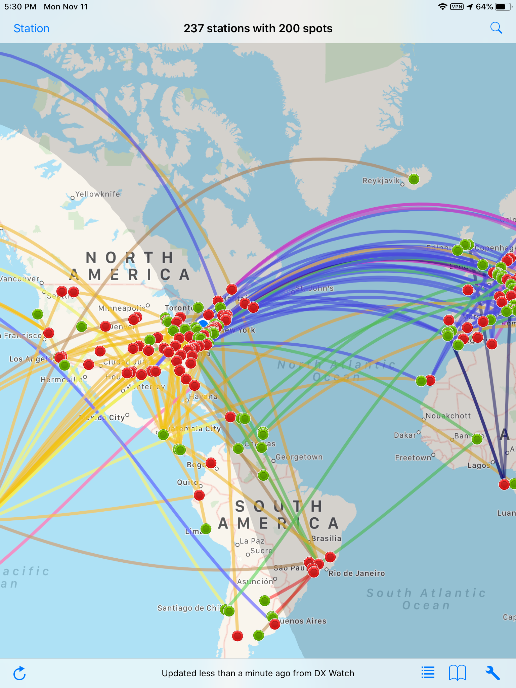
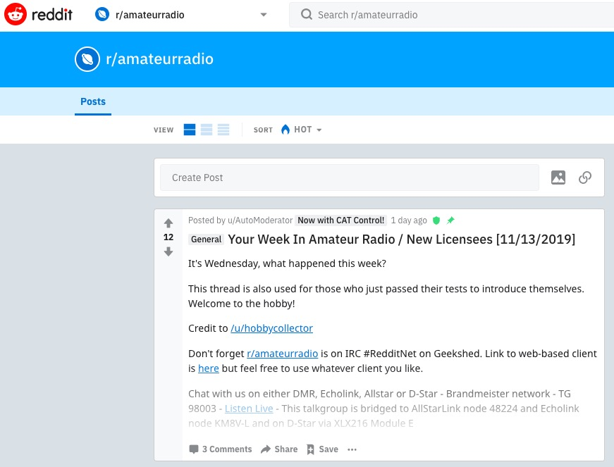

```{r setup, include=FALSE}
knitr::opts_chunk$set(echo = FALSE,
                      warning = FALSE, 
                      message = FALSE,
                      fig.align = "center")
```

# Preliminaries

---

- Professor of Psychology
- Penn State Amateur Radio Club Faculty Advisor, K3CR license trustee
- [Nittany Amateur Radio Club](https://nittanyarc.net) Mountaintop Clubhouse Co-Manager
- Ham since June 2016

## Agenda

- Radio is everywhere
- A zillion hobbies in one
- Next steps

# Radio is everywhere

---

```{r}
knitr::include_graphics("https://icdn6.digitaltrends.com/image/digitaltrends/smartphones-1175-1500x993.jpg")
```

---

- [Wifi](https://en.wikipedia.org/wiki/List_of_WLAN_channels#:~:targetText=The%20802.11%20standard%20provides%20several,into%20a%20multitude%20of%20channels) (900 MHz, 2.4 GHz, 5 GHz)
- [Bluetooth](https://en.wikipedia.org/wiki/Bluetooth), (2.45 GHz)
- [GPS](https://en.wikipedia.org/wiki/GPS_signals), 1575.42 MHz; 1227.60 MHz; 1023 MHz.
- [Cell/mobile](https://en.wikipedia.org/wiki/Cellular_frequencies), (too many to list!)

# A zillion hobbies in one

## Summits on the Air (SOTA)

```{r, out.width="800px"}
knitr::include_graphics("https://www.mountbakerexperience.com/wp-content/uploads/2017/11/KG7EJT-on-Carne-Mountain-2-1024x683.jpg")
```

<small>
<https://www.mountbakerexperience.com/summits-on-the-air-dispatches-from-a-society-of-mountaintop-radio-operators/>
</small>

## National Parks on the Air (NPOTA)

```{r}
knitr::include_graphics("https://ke2yk.files.wordpress.com/2016/07/acadia_npota.jpg")
```

## Walmart Parking Lots on the Air (WPLOTA)

```{r, out.width="800px"}
knitr::include_graphics("https://i.redd.it/wnn5bygi9lu01.png")
```

---

<iframe width="800" height="450" src="https://www.youtube.com/embed/EGw7ZIIsKWs" frameborder="0" allow="accelerometer; autoplay; encrypted-media; gyroscope; picture-in-picture" allowfullscreen></iframe>

## Contesting

```{r, out.width="750px"}
knitr::include_graphics("https://1.bp.blogspot.com/-fKyBeZYdRPk/W4BcgOCGxSI/AAAAAAAAEAE/4voRqngLYjQRAjUB3HZDNCh8qoK2C6VVgCLcBGAs/s320/p1.jpg")
```

<small>
Ria Jairam, N2RJ
</small>

---

```{r, out.width="1000px"}
knitr::include_graphics("img/contest-calendar.jpg")
```

<small>
<https://www.contestcalendar.com/weeklycont.php>
</small>

## World Radiosport

```{r, out.width="700px"}
knitr::include_graphics("img/wrtc-2018.jpg")
```

<small>
<https://en.wikipedia.org/wiki/World_Radiosport_Team_Championship>
</small>

## Weak signal modes

```{r}
knitr::include_graphics("https://dx-world.net/wp-content/uploads/2017/09/flex_ft8.jpg")
```

## Software defined radio (SDR)

```{r, out.width="1000px"}
knitr::include_graphics("https://qrznow.com/wp-content/uploads/2019/01/6400M.png")
```

## Atmospheric Science

```{r, out.width=="700px"}

```

## Emergency/Event Communications

```{r}
knitr::include_graphics("https://news.psu.edu/sites/default/files/styles/threshold-992/public/hero-ham.jpg?itok=RCPoJ3ur")
```

---

```{r}
knitr::include_graphics("https://qrznow.com/wp-content/uploads/2018/09/b0f649f8-0a14-416a-af18-a36ba5de594c.jpg")
```

## Build & launch a cubesat

```{r}
knitr::include_graphics("https://mk0spaceflightnoa02a.kinstacdn.com/wp-content/uploads/2015/10/acd13-0175-016_1.jpg")
```

<small>
<http://www.cubesat.org/>
</small>

## Talk to space

<https://www.n2yo.com/?s=28375>

## Collegiate Amateur Radio Initiative

```{r, out.height="500px"}
knitr::include_graphics("https://qrznow.com/wp-content/uploads/2019/01/2016_Funkcamp_YOTA_10.jpg")
```

## Go where no one has...

```{r}
knitr::include_graphics("https://dxnews.com/upload/images/x3y0-bouvet-23_03.jpg.pagespeed.ic.eAml1_REj6.jpg")
```

---

```{r, out.width="800px"}
knitr::include_graphics("https://dx-world.net/wp-content/uploads/2018/07/KH1.-QSL-JB8-final.jpg")
```

---

```{r, out.width="800px"}
knitr::include_graphics("https://gdxf.de/megadxpeditions/qsls/3b7a.jpg")
```

## Hack hardware

```{r}
knitr::include_graphics("http://www.highonsolder.com/wp-content/uploads/2017/09/IMG_1024.jpg")
```

---

```{r}
knitr::include_graphics("https://heilsound.com/wp-content/uploads/2017/04/IMG_0835.jpg")
```

---

```{r}
knitr::include_graphics("https://preview.redd.it/yknot69u9xx31.jpg?width=640&crop=smart&auto=webp&s=1b40bb303f082dd88f257c51803bde70e5c10520")
```

## Build RF-based data networks

```{r}
knitr::include_graphics("img/aredn.jpg")
```

<small>
<https://www.arednmesh.org/>
</small>

## Operate anywhere!

<iframe src="http://www.remotehamradio.com/" height=550px width=800px>
</iframe>

<small>
<http://www.remotehamradio.com/>
</small>

## Automatic Packet Reporting System (APRS)

<https://aprs.fi/#!addr=state%20college>

---

```{r, fig.cap="Packets heard by K3ROG-10 in Jan 2020"}
knitr::include_graphics("img/K3ROG-10-2020-Jan.jpg")
```

## Learn new languages

<iframe width="560" height="315" src="https://www.youtube.com/embed/43zA_wokXtY" frameborder="0" allow="accelerometer; autoplay; encrypted-media; gyroscope; picture-in-picture" allowfullscreen></iframe>

## Join a world-wide community

```{r, out.width="700px"}

```

<small>
<https://www.reddit.com/r/amateurradio/>
</small>

---

```{r, out.width="700px"}
knitr::include_graphics("img/hf-nets.jpg")
```

<small>
<https://docs.google.com/spreadsheets/d/1cpaIUPJOG9Kdb0Xo-hyzhcVKcyvOr37vrGIF1mIETHs/edit#gid=906307814>
</small>

# Next steps

## Get licensed

- [Technician](https://hamstudy.org/tech2018)
- [General](https://hamstudy.org/general2019)
- [Amateur Extra](https://hamstudy.org/extra2016)

---

```{r, fig.cap="https://hamstudy.org"}

```

## Join a club

- Nittany Amateur Radio Club, <k3rog@arrl.net>, <https://www.nittany-arc.net/>

## We are...

## K3CR

Penn State Amateur Radio Club</br>
<k3cr@psu.edu>

## A Penn State tradition

```{r, out.height="500px"}

```

## Get on the air!

```{r}
knitr::include_graphics("https://qrznow.com/wp-content/uploads/2019/01/2016_Funkcamp_YOTA_10.jpg")
```

## Why ham radio?

---

It's fun!

---

<!-- The geek shall inherit the earth -->
```{r, out.height="600px"}
knitr::include_graphics("http://2.bp.blogspot.com/-diuIIhRGNkc/VilyO4VqL0I/AAAAAAAAAGk/SRDaEBkxeS8/s400/The%2BGeek%2BShall%2BInherit%2BThe%2BEarth.jpg")
```

---

da-da-di-di-dit di-di-di-da-da</br>
da-di-dit dit</br>
da-di-da di-di-di-da-da di-da-dit da-da-da da-da-dit

73 de K3ROG</br>
(Best wishes from me)
